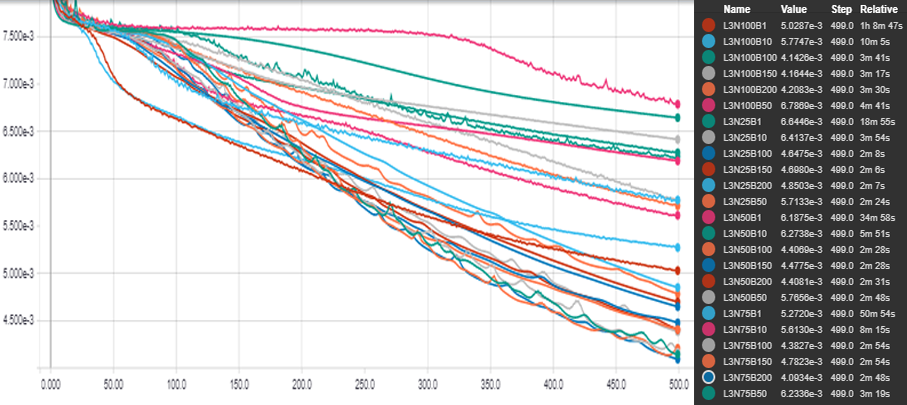
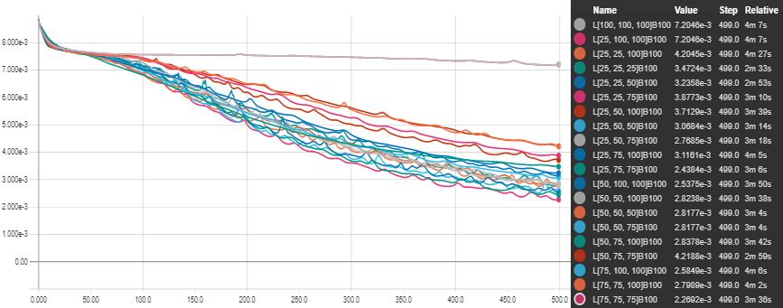
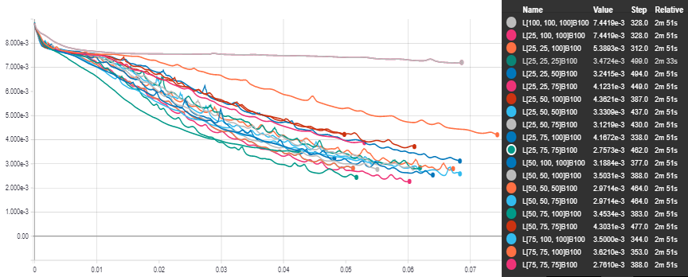
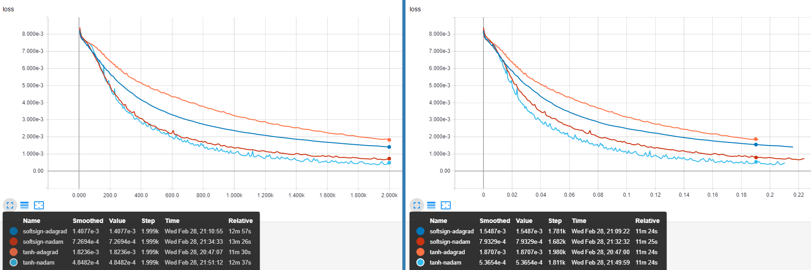

**Resumo**

Palavras-chave:

**Abstract**

Keywords:

Lista de Quadros

Lista de Figuras

Lista de Tabelas

Lista de Siglas

Sumário

# Introdução
O presente trabalho investiga, sob diferentes perspectivas, o potencial de aplicação dos recentes desenvolvimentos teóricos na área de redes neurais à modelagem de instrumentos acústicos, com vistas à sintese sonora em tempo real. Enfase é dada a intrumentos de caráter percussivo, no sentido de instrumentos em que o som é gerado por uma excitação inicial, aproximadamente impulsiva do ponto de vista físico, e a subsequente vibração livre do(s) componentes pertinentes do instrumento. Esse é o caso, por exemplo, das peças de um kit de bateria excitadas por uma baqueta, dos (conjuntos de) cordas de um piano acionadas pelo martelo alavancado pelo pressionar das teclas e, com um maior grau de aproximação, a excitação causada pelos dedos ou palheta em instrumentos de corda.

A grande área denominada Inteligência artificial é um dos campos da ciência mais explorados na atualidade, sendo utilizada em uma gama crescente de aplicações que cobrem desde o entretenimento à saúde, passando por campos como segurança e políticas públicas. Sundar Pichai, atual CEO do Google, afirmou recentemente em um discurso no Fórum Econômico Mundial que a "inteligência artificial é provavelmente a coisa mais importante na qual a humanidade já trabalhou", equiparando sua importância à eletricidade e ao fogo e declarando ainda que esta tecnologia é o coração do Google[@cnnmoney]

O comentário ilustra, excluídos superlativos midiáticos, a centralidade do tema no modelo de negócios de uma das maiores empresas do mundo, tendência acompanhada por  outros gigantes da tecnologia, como Apple e Microsoft. Na contramão desse movimento, no entanto, observa-se uma escassa utilização dessa tecnologia por empresas do ramo de instrumentos virtuais, talvez motivada pelo baixo volume de pesquisas ne área; Um levantamento bibliográfico revela que trabalhos relacionados à utilização de redes neurais para a simulação de instrumentos musicais ainda são bastante escassos, a despeito do sucesso desta ferramenta em áreas afins.

O potencial de inovação desse campo é comprovado pelo papel central (muitas vezes representando o estado da arte) que as redes neurais artificiais vem desempenhando em áreas diretamente correlatas, com o campo de síntese de voz (text-to-speech), ou ainda em campos menos obviamente relacionados, à exemplo dos grandes avanços na área de _computer vision_, como a geração de imagens e videos, transferência de estilos (e até rostos) entre essas mídias, colorização automática ou semi-automática de imagens em preto e branco e a constante investigação e refinamento de novas arquiteturas e métodos aplicados à essas finalidades.

Esses resultados estimulam a transposição de algumas dessas técnicas e _insights_ para o caso da síntese sonora, principalmente quando percebemos que o tratamento da representação do som em forma digital, comumente representado na forma de um vetor unidimensional representando posições da onda sonora original, contínua, em relação ao tempo, é um caso específico da representação de imagens por vetores bi ou tridimensionais.

Do ponto de vista da indústria, embora o interesse por instrumentos musicais digitais (DMIs) tenha crescido bastante na última década[@staudt2016development], os instrumentos virtuais considerados _industry standard_ ainda baseiam-se prioritariamente em extensas coleções de _samples_, demandando uma alta quantidade de memória e poder de processamento do _hardware_ utilizado.

## Problema: simulação em tempo real de instrumentos **acústicos** (aplicação: bateria)

## Questão de pesquisa
Busca-se, desta forma, identificar metodologias que deem suporte à modelagem de instrumentos musicais acústicos, com a aplicação do estado da arte das redes neurais, dando origem a simulações mais realistas, principalmente do ponto de vista da percepção humana, e mais eficintes do ponto de vista computacional.

A proposta inclui a identificação da arquitetura mais apropriada, assim como seus parâmetros, incluindo o número de camadas, neurônios, a mais apropriada forma de atualização dos pesos e eventuais formas de tratamento dos dados utilizados no treinamento.

## Escopo
## Estrutura
## Relevância <!-- socio-econômica -->

# Revisão Bibliográfica
## Redes Neurais Artificiais
No contexto mais amplo da inteligência artificial, redes neurais artificiais possuem um papel primordial, pois tem sido, em suas diversas encarnações e arquiteturas, o principal representante da inteligência artificial em diversas aplicações práticas.

Multidisciplinar desde o nascimento, o desenvolvimento das redes neurais artificiais pode ser remontado aos primeiros esforços para sistematização teórica da forma como o cérebro humano funciona, a partir dos trabalhos de Hermann von Helmholtz, Ernst Mach e Ivan Pavlov, na virada do século 19[@hagan1996neural].

Em 1943, o neurofisiologista Warren McCulloch e o matemático Walter Pitts foram responsáveis por formular o primeiro modelo matemático conhecido do cérebro humano[@mcculloch1943logical], mostrando que topologias simples podem, em princípio, encarregar-se de operações aritméticas e lógicas[@yadav2015introduction] complexas.

O primeiro passo para a utilização prática das redes neurais foi dado no final da década de 1950 por Frank Rosenblatt[@hagan1996neural], em sua proposta ao laboratório aeronáutico de Cornell de um autômato baseado em seu modelo simplificado de neurônio, o perceptron[@Rosenblatt57].

Tomando como base também as teorias de McCulloch, Widrow desenvolveu a ADALINE (Adaptive Linear Neuron)[@widrow1960adaptive] bastante similar em estrutura ao modelo de Rosenblatt, e partilhando de suas limitações. O modelo de treinamento proposto, no entanto, era consideravelmente mais robusto, sendo utilizado até hoje.

A motivação final de Rosenblatt, inspirada nas teorias sobre o funcionamento do cérebro humano apresentadas por autores como Culbertson, Von Neumann e Ashby [@rosenblatt1958perceptron] era a construção de uma máquina capaz de aprender à responder diretamente à estímulos físicos externos, como sinais luminosos.

Para tanto, tal máquina utilizaria como unidade fundamental o Perceptron, que funciona matematicamente como uma função aplicada à soma ponderada das entradas e dos viés dando origem a um classificador linear, capaz de atualizar seus pesos para aprender, através de exemplos de inputs e os correspondentes outputs desejáveis, a separar linearmente classes diferentes.

A despeito das limitações práticas do modelo proposto, como expostas de maneira um tanto pessimista por Minsky[@minski1969perceptrons], é interessante notar que muitas das características contemporaneas já estavam presentes nos trabalho seminais de Rosenblatt e Widrow, notadamente o caráter estocástico das redes neurais, a necessidade de treiná-las com base em grandes conjuntos de dados e a característica de _black box_ do modelo treinado.  

É interessante observar que Widrow introduziu, como forma de treinamento, uma caso restrito do algoritmo de descida em gradiente, que veio a ser amplamente responsável pelo ressurgimento do interesse em redes neurais décadas mais tarde, em conjunto com a técnica de _backpropagation_.

O modelo de Rosenblat, tendo tido sua primeira implementação na forma de uma simulação em um computador IBM 704 [@bishop06], ao contrário da intenção inicial de utilizar hardware específico, inaugura também a prática da simulação neural.

Enquanto uma arquitetura baseada em uma única camada de Perceptrons apresenta severas limitações, o agrupamento sucessivo dessas camadas dá origem a uma topologia, conhecida como Multilayer Perceptron, capaz de atuar como um aproximador universal [@hornik91]. Desde que utilize uma função de ativação não-linear[@leshno93], e dado um número suficiente de neurons na camada oculta, essa topologia é capaz de mapear qualquer conjunto de números finitos a qualquer outro com precisão arbitrária[@hornik89].

Um outro impedimento práticos do trabalhos de Rosenblatt e Widrow foi a ausência de uma metodologia eficiente para a atualização dos pesos da rede, sobretudo envolvendo múltiplas camadas de neurônios - caso não coberto pelos algortimos iniciais tanto de Rosenblat quanto de Widrow; tal metodologia veio a ser proposta originalmente por Werbos em 1974 **XXX**. Contudo, essa técnica permaneceu pouco conhecida na comunidade até ser redescoberta por Parker[@parker1985learning] e, pouco tempo depois, Rumelhart[@rumelhart1985learning] na segunda metade da década de 1980 [@mizutani2000derivation] [@widrow199030]. O algoritmo, que é conhecido como _backpropagation_, foi um dos responsáveis por reaquecer o interesse no campo[@hagan1996neural] na época, inaugurando sua fase atual, com o surgimento dos principais congressos sobre o assunto, como o _IEEE International Conference on Neural Networks_ e periódicos, a exemplo do _INNS Neural Networks_, ao fim da década de 1980[@yadav2015introduction].

Nos anos seguintes, observou-se uma profusão de novas arquiteturas, que foram aprofundando-se na media em que a utilização de mais camadas ocultas fora possibilitadas pelos avanços no _hardware_ computacional. Outras formas de organizar camadas sucessivas foram também introduzidas, além de vários avanços incrementais nos algoritmos de treinamento.

## Arquiteturas Proeminentes

### Feed-Forward
A arquitetura básica no campo das redes neurais artificiais é a chamada Feed-Forward, que consiste de várias camadas sucessivas, que são totalmente ligadas entre si por meio de pesos. Os impulsos recebidos pelas camadas mais baixas fluem sucessivamente para as camadas posteriores, como sugere a nomenclatura desta arquitetura. São uma generalização do Multilayer Perceptron na medida em que utilizam em geral uma gama mais vasta de funções de ativação, muitas delas de forma sigmoidal, como a função logística $y = \frac{1}{1 + e ^ {-x}}$   and the hyperbolic tangent $\tanh(x) = \frac{e^x − e^{-x}}{e^x + e^{-x}}$ [@goldberg2016primer]

### Redes Neurais Profundas
Com a melhoria do hardware, a topologia Feed-Forward foi ganhando um acréscimo de camadas, gerando as redes profundas (Deep Neural Networks). O aspecto mais importante dessa movimentação foi que as redes ganharam a habilidade de gerar representações sucessivas, abstraindo diferentes aspectos dos dados em cada uma de suas camadas.

A grande vantagem desta topologia foi sua capacidade automática de extração de 'features', um trabalho que ficava a cargo dos pesquisadores anteriormente[@socher2014recursive]. Em contrapartida, já forma como os dados são interpretados pela rede pode não ser facilmente inferida pelo pesquisador, e as redes podem assumir uma forte característica de caixa-preta.

### Redes Recorrentes
Em redes recorrentes os neurons são parcialmente alimentados com seus próprios estados anteriores, emulando um efeito similar à utilização de ligações entre neurons de uma camada abaixo com neurons de uma camada acima não adjacente [@veit2016residual].

Essa arquitetura foi proposta por Elman [@elman1990finding] em 1990 com o propósito de capturar
informações codificadas no encadeamento temporal os dados, e é bastante poderosa em várias aplicações, como modelos de previsão e classificação de informações[@xu2015ccg], por exemplo.

### Redes Convolucionais
Trata-se de um tipo de arquitetura profunda, que é amplamente utilizado em problemas relacionados a imagens, atingindo resultados de ponta em várias áreas de visão de computadores (computer vision), como reconhecimento de objetos e rostos em imagens [@pang2017convolution].

Esse tipo de arquitetura lida com o problema da alta dimensão de uma imagem substituindo camadas totalmente conectadas por camadas convolucionais, que varrem a imagem, movimentando-se em uma de suas dimensões um passo por vez cada vez [@lecun1998gradient], e atualizando os pesos de acordo.

Esse procedimento permite a geração, nas camadas convolucionais da rede, de uma só representação para padrões que aparecem em diferentes pontos da imagem; tais representações são geralmente interpretadas nas camadas finais da rede, totalmente conectadas, de forma a gerar o resultado final.

## Utilização de ANNs em áreas correlatas
Poucos trabalhos investigam a utilização de redes neurais para a síntese sonora direta. Não obstantes, algumas das áreas correlatas são bastante exploradas, e podem oferecer insights interessantes.

### Reconhecimento e Síntese de Voz

[@hinton2012deep] present an overview of the use of neural networks based approach in the field, while in this same year, [@graves2013speech] produces state of the art results in the TIMIT phoneme recognition benchmark using a deep recurrent neural network, while [@maas2013rectifier] points the superiority of rectifier nonlinearities over sigmodal activation functions in the task of continuous speech recognition.

With a hybrid architecture, combining a recurrent phonetic model and a deep neural network acoustic classifier, [@boulanger2014phone]  applies phone sequencing strategies to set new benchmarks in the TIMIT dataset, a technique that is proved by [@sak2015fast] to be superior to architectures like deep long short-Term memory recurrent neural networks and the widely used hidden Markov models.

[@sainath2015deep] investigates the optimization of convolutional nets hyperparameters, pooling and training strategies to applications in speech recognition tasks. [@zweig2017advances] and [@zhang2017towards]  investigates end-to-end systems, with the latter combining hierarchical convolutional nets with Connectionist Temporal Classification. In his work, [@zhang2017very] also explores end-to-end systems, via a very deep recurrent convolutional network employing NIN principles.

Speech synthesis state of the art, as seen in text-to-speech applications, for instance, is not yet achieved via end-to-end neural network approaches. Nonetheless, this area is being actively researched, and approaching production quality rapidly. [@zen2015unidirectional] tackles this task using unidirectional long short-term memory recurrent neural networks with a recurrent output layer, while [@wu2016investigating] further investigates this architecture, trying to discover the reasons for its effectiveness, and pinpoint wich factor are more relevant to que quality of the task, with the goal of offering a simplified topology.

### Music
Em geral os trabalhos relacionados à música ocorrem em um nível de abstração mais alto do que a geração direta dos sons, envolvendo a manipulação de representações musicais como partituras, por exemplo.
Many language processing techniques are used in the music field; similarly, many image tasks can be translated to music, given a suitable representation for the input data, like spectrograms.

#### Classification
This task involves assigning tags, generally genre-related or emotion related, to musical pieces. [@costa2017evaluation] and [@choi2016automatic] tackles this task with a fully convolutional neural network fed, in the latter case, with music represented by a mel-spectrogram, while in [@choi2017convolutional] a recurrent architecture is also explored, to exploit the temporal correlation of the inputs.

#### Transcription
the common task in this field is to translate music parts, generally specific instruments, into a symbolic representation, like tablatures or music scores, for example. One of the first contributions to this field is seen in [@tuohy2006evolved] via the coupling of a network and a local heuristic hill-climber applied over the results, to generate tablatures from music.

With the use of a recurrent net, [@boulanger2013high] transcribes spectrograms of general musical parts into piano roll midi commands, while [@bock2012polyphonic] offers a similar approach, restricted to polyphonic piano sound, as in the case of [@sigtia2016end]. The last work, however, uses different architectures for the acoustic, a simple network and the language, a recurrent network model. With the use of a bidirectional recurrent net fed with spectral representations, [@southall2016automatic], creates drum representations.

#### Generation
Here the aim is the inverse of that in the music transcription: given a representation, audio output is generated. One of the first works in the field is seen in[@stanley2007compositional], consisting of a compositional pattern producing network generating music on the fly based on user input.  [@hutchings2017talking] generates full drum parts based on a kick drum pattern, with a recurrent net, and investigates the quality of the results via an online survey.

#### Image Compression
Despite beeing an important field in face of the communication era demands[@rehman2014image], the last review about the use of neural networks in image compression was made in 1999[@jiang1999image], while the last general review about the area dates from 2014[@rehman2014image].

[@balle2016end] proposes the use of stages of linear convolutional filters and non-linear activation functions, improving the Multiscale Structural Similarity for Image Quality Assessment(MS-SSIM) measure in all bitrates.

Superior measurements, with the same metrics, to standard compression methods such as JPEG and WebP, were obtained by [@johnston2017improved], using a recurrent architecture with SSIM loss function and adaptive bit allocation algorithm.
With a modified loss function, [@theis2017lossy] shows that autoencoders can achieve compressing results comparable with JPEG 2000 format.

[@toderici2016full] also produces results better than standard codecs via different architectures based on recurrent neural networks, a binarizer, and a neural network for entropy coding.

Using a fuzzy neural network, [@wang2015image] achieves superior speed, robustness and quality in lossy image processing tasks. [@toderici2015variable] presents a progressive method, focused on reducing mobile phone data transfer, that allows arbitrary image quality depending on the quantity bits sent to the device. [@santurkar2017generative] investigates the resilience of neural networks based compression, via a generative model capable of offering graceful degradation on the compressed images. Conceptual compressing is investigated by [@gregor2016towards], a technique that allows images to be retrieved from symbols. All the literature investigate deals with lossy compression.

### Imagem
Recentemente tem-se visto esforços para adaptar métodos utilizados com sucesso na área de computer vision ao campo sonoro. O trabalho de [@engel2017neural], por exemplo, busca inspiração na área de geração de imagens para elaborar uma arquitetura apropriada a síntese sonora.
Ainda em paralelo com a área de relacionada à imagens, o autor propõe um base de dados sonora, Nsynth, à luz de datasets clássicos de imagens, como o MNIST.

#### Síntese
[@isola2016image] presents a method to translate images via an adversarial network, generating images from outlines, for example, or providing automatic image colorization [@hwangimage], [@zhang2016colorful], [@larsson2016learning]  and  [@iizuka2016let], the last focusing on automatic image colorization via a convolutional network, based on the extraction of local and global features, learned in the supervised training process.

Also using adversarial nets, [@frans2017outline] introduces control to the process of generating coloured images from sketches, with the use of colour maps fed into the , a concept that is further explored in [@sangkloy2016scribbler], where user interaction and a feed-forward architecture enables real-time colorization of images via the input of colour clues via scribbles in arbitrary areas of the image.

[@gatys2016image] tackles the problem of style transfer: extracting features of an image and applying to another one, without changing the semantics of the latter, with the application of a convolutional network.

[@kulkarni2015deep], on the other hand, proposes a method that enables a convolutional-deconvolutional network to disentangle the features extracted from images, allowing the manual generation of images in different positions and lighting conditions via the tweak of variables fed to the network. Also investigating image manipulation, by means of adversarial nets, [@zhu2016generative] attempts to learn features directly from raw data.

[@oord2016pixel] proposes a deep recurrent topology, with improved residual connections, capable of reconstructing occluded images, that could be also used in image compression tasks.

[@theis2015generative] investigates a recurrent architecture composed of multi-dimensional long short term memory units in the context of modelling image distributions.

#### Video
Problems in this area can be understood as a general case of aforementioned image-related tasks, with the added complexity of taking advantage of temporal correlations and a much higher data dimensionality.  Motivated by this, [@karpathy2014large] investigates approaches capable of extending convolutional neural networks in order to enable them to take advantage of temporal information in the inputted data. In a similar attempt, extending facial expression recognition to videos, [@khorrami2016deep] merges convolutional and recurrent networks, measuring the relative relevance of each one in the final results. Tackling the curse of dimensionality, [@Yang2017] presents the tensor-train concept, enabling the transfer of improvements of other architectures to high dimensional sequential data. [@he2015multimodal] uses a deep bidirectional long short-term memory recurrent neural net to set benchmarks in the recognition of emotions, via audio and video processing.

## O Estado da Arte da Síntese Sonora em Tempo Real

A área de síntese sonora propriamente pode ser dividida em duas escolas, na medida em que ocupa-se em modelar os processos físicos que dão origem aos som (physical modelling) ou diretamente as características das ondas sonoras (spectral modelling)[@serra2007state].

Dessas escolas, a modelagem física é, de longe, a mais proeminente tanto do ponto de vista da pesquisa quanto de aplicações; a área de modelagem espectral parece ter despertado pouco interesse dos pesquisadores nas últimas duas décadas, encontrando a maioria de suas aplicações recentes em áreas fora da síntese musical.

A modelagem física ocupa-se majoritariamente em formular modelos discretos baseados na solução de D'alembert para a equação da onda[@karjalainen2004digital], incorporando ao modelo outros termos, como termos oriundos da rigidez das cordas, que modelem características relevantes ao timbre do instrumento que deseja-se representar[@bensa2003simulation]. Destacam-se, nessa escola, duas abordagens: o método das diferenças finitas, mais acurado e computacionalmente intensivo, e os _Digital Waveguides_, um modelo bastante eficiente[@bensa2005computational] e elegante que é, talvez, o mais utilizado para a emulação em tempo real de instrumentos acústicos.

### Método das Diferenças Finitas (Finite difference)

O método consiste na resolução da equação da onda propagando-se em uma corda ideal, introduzida abaixo e derivada com mais detalhes na seção seguinte.

$$\frac{\partial^2 y(x,t)}{\partial t^2} =\frac{T}{\rho} \frac{\partial^2 y(x,t)}{\partial x^2}$$

A solução é buscada para pontos em um _grid_ obtido discretizando-se tanto o tempo $t$ quanto a posição horizontal $x$. Isso permite a aproximação das derivadas parciais de segunda ordem pelo método das diferenças centrais. Assim procedendo, podemos reescrever a equação da onda como abaixo.

$$\frac{y[i,j+1]-2y[i,j]+y[i,j-1]}{\Delta t^2} = c^2 \frac{y[i+1,j]-2y[i,j]+y[i-1,j]}{\Delta x^2}$$

onde

$c=\sqrt{\frac{T}{\rho}}$

$x_i = i \Delta x, i \in \{0,1,...,M\}$

$t_j = j \Delta t, j \in \{0,1,...,N\}$

e, colocando $y[i,j+1]$ em evidência:

$$ y[i,j+1] = 2 y[i, j] - y[i,j-1] + C^2 (y[i+1, j] - 2 y[i, j] + y[i-1, j])$$

onde foram aglutinados em $C=c \frac{\Delta t}{\Delta x}$, denominado número de Courant, todos os parâmetros que governam a qualidade da simulação. Para garantir sua estabilidade, os parametros devem ser fixados de modo que $C$ seja menor que 1.

Repare que $ y[i,j+1]$ é calculado com base no ultimo e penultimo momentos discretos, o que demanda, para o primeiro passo da simulação em $j = 1$, a definição do estado do sistema em $j=0$, que é seu estado inicial, e informações sobre o sistema no momento discreto $j=-1$, que é indefinido.

Como condições de contorno para o caso contínuo temos que, no momento inicial, a corda encontra-se apenas deslocada do seu equilíbrio. Portanto, a velocidade em $t=j=0$, para qualquer ponto $x$ da corda, tem valor zero. Ademais, a corda encontra-se fixa em suas extremidades $x=0$ e $x=L$. Para primeira condição podemos escrever:

$$ \frac{\partial y(x,t)}{\partial t} \approx \frac{y[i,1]-y[i,-1]}{2 \Delta t} = 0 ~ \forall ~ i \in \{0,1,...,M\} $$

o que implica:

$$ y[i,1] = y[i,-1] ~ \forall ~ i \in \{0,1,...,M\} $$

Assim, para o primeiro momento da simulação em $j=1$ podemos substituir $y[i,-1]$ por $y[i,1]$:

$$ y[i,j+1] = y[i, j] + \frac{1}{2} C^2 (y[i+1, j] - 2 y[i, j] + y[i-1, j])$$

### Digital Waveguides

Apresentam uma abordagem simplificada da modelagem física, na medida em que concentram em alguns pontos discretos os calculos necessários à simulação, aumentando bastante a eficiência computacional do modelo. Conceitualmente, podem ser vistos como uma caso especial do método das diferenças finitas, e a maioria de suas implementações consistem na utilização de *delay lines* e filtros digitais para a modelagem da propagação da onda[@smith2006basic].

Se considerarmos, por exemplo, um framerate típico de 44100 frames por segundo podemos evitar desperdício computacional fazendo com que a simulação conincida com o intervalos 1/44100 entre os *samples*. De modo geral, levando em conta que $C <= 1$, podemos parametrizar a simulação em termos dos componentes físicos e o *sampling rate* desejado da seguinte forma:

$dt = \frac{1}{FPS} = \frac{D}{N}$
$N = D ~ FPS$
$dx = \frac{L}{M}$
$M <= \frac{FPS}{2f}$
$c = 2fL$

onde $D$ é a duração desejada, em segundos; $L$ é o comprimento da corda, em metros e FPS é o *framerate* pretendido.

# Referencial Teórico

## Acústica e Psicoacústica

## Ferramentas e Frameworks

A área de machine learning encontra-se muito ativa atualmente, tanto no âmbito da pesquisa quanto no empresarial, com várias grandes empresas de tecnologia incorporando essa tecnologia em suas competências essenciais. Dessa forma, assistimos à uma proliferação de ferramentas e frameworks focados em diferentes aspectos da área, muitos deles desenvolvidos ou endossados por essas empresas, como Microsoft, Google e Amazon. Somando-se a isso o fato de que, em maior ou menor grau, todos eles apresentam uma curva de aprendizado significativa, fica evidente que uma comparação direta de todos, ou mesmo da maioria das ferramentas disponíveis, torna-se impraticável em um horizonte de tempo razoável.

A literatura disponível sobre o tema é bastante escassa, talvez pela volatilidade do tema.

<!-- ## Algoritmos de Otimização -->

## Transformada Discreta de Fourier

A transformada de Fourier, em sua forma contínua, é um tipo de transformada integral, como abaixo:

$$
X(f) = \mathcal{F}(x(t))=\int_{-\infty}^\infty x(t) e^{- 2 \pi f t \ i} dt
$$

$$
x(t) = \mathcal{F}^{-1}(X(f))=\int_{-\infty}^\infty X(f) e^{2 \pi f t \ i} df
$$

Tendo sido formulada por Fourier, enquanto investigava o fenômeno da transferência de calor **xxx**, trata-se de uma das ferramentas mais utilizadas na investigação de sistemas físicos [@lyons2011understanding], sendo de especial importância no campo de processamento de sinais **xxx**.

Esta ferramenta permite que a descrição de um sinal $x(t)$, em relação ao tempo, seja transformada em uma representação deste mesmo sinal no domínio da frequência, na forma $X(f)$; $x(t)$ e $X(f)$ são denominados um par de Fourier.

Com o advento dos computadores, e a emergência de sinais digitais, uma versão discreta foi formulada **xxx**, e pode ser definida como abaixo:

$$
X[m] =\sum_{n=0}^{N-1} x[n] e^{- 2 \pi m n / N ~ i}
$$
$$
x[n] = \frac{1}{N}\sum_{m=0}^{N-1} X[m] e^{2 \pi m n / N ~ i}
$$

onde $x$ e $X$ são sequências de N números complexos. Utilizando a fórmula de Euler, $e^{x ~ i} = \cos(x) + \sin(x)~i$, podemos alterar a definição acima, da forma exponencial, para a trigonométrica, reorganizando o expoente de forma a evidenciar algumas características importantes, na forma abaixo.

$$
X[m] =\sum_{n=0}^{N-1}
x[n] \cos \left(m ~ \frac{2 \pi}{N} ~ n \right)-
x[n] \sin\left(m ~ \frac{2 \pi}{N} ~ n \right) ~ i
$$

A forma acima torna mais fácil uma interpretação geométrica do algoritmo. Para cada valor de $m ~ \in ~ {0,1,2,...,N-1}$ é feita a multiplicação, elemento a elemento, das N posições do impulso $x$ com N posições de um onda em forma de cosseno ($C(m)$), pura, de "frequência" m, na parte real da equação. Analogamente, em sua parte imaginária, o mesmo processo ocorre: cada posição medida do impulso $x$ também é multiplicada pela posição equivalente, desta vez, de uma onda em formato de seno($S(m)$), com "frequência" m.

Note-se que esta "frequência", e por isso a insistência nas aspas, refere-se a quantos ciclos das ondas ($C(m)$) e ($S(m)$) acima definidas estão contidos no espaço dos N pontos utilizados na transformada e não pode, per-se, ser relacionada à frequência física da onda.

Para o caso de sinais que, no domínio do tempo, consistem de uma sequência finita de números reais, que são os considerados neste trabalho, pode-se, à luz da definição acima, derivar uma interessante e útil propriedade do algoritmo: A descrição do sinal no domínio da frequência é simétrica, de forma que $X[m] = X^* [N-m]$, com $X^* $ denotando o conjugado complexo de $X$. Dessa forma, sendo $N$ par, precisamos de apenas de $N/2+1$ termos de $X[m]$ para descrever completamente o pulso no domínio da frequência, enquanto $(N+1)/2$ são suficientes caso $N$ seja ímpar. A imagem abaixo ilustra este processo.

Trata-se de uma transformada de uma onda composta por 8 samples, que pode ser vista no retangulo inferior da imagens. Os outros retangulos ilustram os respectivos passos e a simetria entre passos equidistantes de n/2. O motivo da simetria, causado pela perda de informação ao tomar apenas alguns pontos, torna-se explícito quando observado do ponto de vista geométrico: os 8 pontos equidistantes tomados como amostra, por exemplo, de uma senoide com frequência igual a 2 coincidem com os retirados de uma senois com frequência igual a 6, já que partes do ciclo são ignorados.

O código em Python a seguir, utilizado para gerar os frames da imagem acima, serve para elucidar numericamente o exposto. É interessante notar que a interpretação geométrica da simetria da transformada discreta de Fourier em ondas puramente reais, até onde alcança o conhecimento do autor, é apresentada pela primeira vez neste trabalho. Cabe observar que implementações mais eficientes, como o algoritmo Fast Fourier Transform (FFT), que os são utilizadas na prática, se utilizam da simetria da transformada para economizar operações **xxx**.

~~~~
import numpy as np
import matplotlib.pyplot as plt
from scipy.fftpack import fft

# Discrete Fourier Transform | Transformada Discreta de Fourier
def DFT(x):
  N = x.shape[0]
  # cria um vetor de N entradas complexas, preenchido com zeros
  X = np.zeros(N, dtype='complex64')
  n = np.array([p for p in range(N)]) # n = {0,1,2,...,N-1}
  # Versão de "alta resolução" de n, usada para o gráfico apenas
  Hn = np.linspace(0, N-1, 100*N) # Hn ={0,...,1,...,2,...,N-1}
  for m in range(N): # m E {0,1,2,...,N-1}
    C_Si = np.exp(-2 * np.pi * m * n / N * 1j) # C(m) - S(m) i
    # Versão de "alta resolução" de C_Si, usada para o gráfico apenas
    HC_Si = np.exp(-2 * np.pi * m * Hn / N * 1j)
    X[m] = sum(np.multiply(x, C_Si)) # multiplicação termo a termo
    # plotando:
    plt.figure(1)
    plt.suptitle('M =' + str(m), fontsize=16)
    plt.subplot(211)
    plt.plot(n,x[n].real, 'k:.', label='x[n]')
    plt.plot(n,C_Si.real, 'k--o', label='C[n]')
    plt.plot(Hn,HC_Si.real, 'k-',label='C[n] ideal')
    plt.ylabel('Real', fontsize=14, color='k')    
    plt.subplot(212)
    plt.plot(n,x[n].imag, 'k:.', label='x[n]')
    plt.plot(n,C_Si.imag, 'k--o', label='C[n]')
    plt.plot(Hn,HC_Si.imag, 'k-',label='C[n] ideal')
    plt.ylabel('Imaginário', fontsize=14, color='k')
    plt.legend()
    plt.savefig('0' + str(m) + '.png', dpi=150)
    plt.close('all')
  #calcula o erro em relação ao algoritmo da biblioteca Scipy
  error = sum((X-fft(x))**2)
  print(round(error,5))
  # retorna a parte não redundante da transformada
  return X[0 : int(N/2+1)] if (N % 2 == 0) else X[0 : int((N+1)/2)]

def s(t):
  return np.cos(2 * np.pi * t)

t = np.linspace(0, 1, 8) # 8 pontos entre 0 e 1
x = s(t) # aplica a função ponto a ponto
X = DFT(x)

# plotando:
plt.figure(1)
plt.subplot(211)
plt.ylabel('Real', fontsize=14, color='k')
plt.stem(X.real,linefmt='k--',markerfmt='ko', basefmt='k--')
plt.subplot(212)
plt.stem(X.imag,linefmt='k--',markerfmt='ks', basefmt='k--')
plt.ylabel('Imaginário', fontsize=14, color='k')
plt.savefig('transform.png', dpi=150)
plt.close('all')
~~~~

## A Equação da Onda
A equação diferencial que descreve o movimento de uma onda em duas dimensões pode ser derivada a partir das leis de Newton, assumindo algumas simplificações. Considerando a imagem abaixo, e as variáveis que a seguem.

$y(x,t)$ a distância entre um ponto qualquer de uma corda e o eixo horizontal no tempo $t$ e na posição $x$;

$\theta(x,t)$ o angulo entre a tangente da corda na posição $x$ e no momento $t$ e a direção horizontal;

$\vec{T}(x,t)$ o vetor representando a tensão na corda, no ponto $x$ e no momento $t$;

Assumindo ainda que qualquer ponto da corda move-se somente na posição vertical temos que a resultante das forças é também vertical, e pode ser descrita como:

$$F(x,t) = T(x + dx,t)\sin(\theta + d\theta) - T(x,t)\sin(\theta) = \\
T(x + dx,t)\cos(\theta + d\theta) \tan(\theta + d\theta) - T(x,t)\cos(\theta)\tan(\theta)$$

assumindo pequenos deslocamentos verticais da corda em relação à sua posição de equilíbrio, temos que $\theta \ll 1$ e, portanto $\cos(\theta + d\theta) \approx \cos(\theta) \approx 1$. 

Além disso, lembrando que as tangentes podem ser escritas como a derivada parcial da função de deslocamento em relação à posição, temos:

$$F(x,t) = T(x+d x, t) \left(\frac{\partial y(x+d x)}{\partial x}\right) - T(x, t) \left(\frac{\partial y(x)}{\partial x}\right)$$

Assumindo tensão uniforme e invariável em toda a extensão da corda, condições bastante razoáveis no contexto de instrumentos musicais, podemos escrever $T(x+d x, t) = T(x, t) = T$ e $F(x,t)$ toma a forma $ T \left(\frac{\partial y(x+d x)}{\partial x} - \frac{\partial y(x)}{\partial x}\right)$, quando colocamos $T$ em evidência. Se assumirmos que a massa do segmento infinitesimal da corda pode ser escrita na forma $\rho dx$, onde $\rho$ é a massa da corda por unidade de comprimento e $dx \approx \sqrt{dx^2+dy^2}$ para oscilações pequenas, aplicando a segunda lei de Newton para força resultante na corda temos $F(x,t) = \rho dx \frac{\partial^2 y}{\partial t^2} $. 

Assim, temos $T \left(\frac{\partial y(x+d x)}{\partial x} - \frac{\partial y(x)}{\partial x}\right) = \rho dx \frac{\partial^2 y}{\partial t^2} $ que podemos reorganizar como $\frac{\partial^2 y}{\partial t^2} = \frac{T}{\rho} \frac{\left(\frac{\partial y(x+d x)}{\partial x} - \frac{\partial y(x)}{\partial x}\right)}{dx}$. Notando que o termo à direita é a segunda derivada de $y$ em relação a $x$, chegamos à equação da onda:

$$\frac{\partial^2 y(x,t)}{\partial t^2} =\frac{T}{\rho} \frac{\partial^2 y(x,t)}{\partial x^2}$$

onde $v = \sqrt{\frac{T}{\rho}}$ é a velocidade de propagação da onda na corda.

Uma solução para essa equação foi proposta por d'Alembert, na forma:

$$y(x,t)=F(x+vt)-G(x-vt)$$ 

Essa equação pode ser intepretada como dois pulsos viajando em sentidos opostos em uma corda infinita com velocidade $v$.

Em $t=0$ podemos escrever:

$y_0(x)=y(x,0)=F(x)-G(x)$

$v_0(x)=y'(x,0)=vF'(x)-vG'(x)$

$vF(x)-vG(x)= \int_{-\infty}^x v_0(\epsilon) d\epsilon$

O que nos dá um sistema de equações que, resolvido, nos permite reescrever a equação de d'Alembert em função das condições iniciais de deslocamento e velocidade na corda, como abaixo:

$$y(x,t)= \frac{1}{2} \Big(y_0(x+vt)-y_0(x-vt) \Big) + \frac{1}{2v}\Big(\int_{x-vt}^{x+vt} v_0(\epsilon) d\epsilon \Big)$$

Essa formulação é importante já que em muitos casos pode-se trabalhar apenas com o deslocamento inicial da corda, o que torna o termo à direita zero.

Alternativamente, pelo método da separação de variáveis, pode-se obter a solução em termos de um soma infinita de senoides estacionárias([@gracia2016wave]):

$$y(x,t)= \sum_{n=1}^{\infty} \big(a_n \cos(2 \pi f_n t) +  b_n \sin(2 \pi f_n t\big) \sin(\frac{n \pi x}{L})$$

onde considera-se uma corda de comprimento $L$ fixa em suas extremidades. $f_n$ são os harmonicos da corda e são dados pela equação $\frac{nv}{2l}$. Além disso, os coeficientes $a_n $ e $b_n$ são dados pelos coeficiente da trasformada de Fourier das condições iniciais em $t=0$ ($y_0(x)$ e $v_0(x)$) ([@salsa2016partial])

essas duas interpretações dão origem às duas escolas distintas de modelagem acústica, como referido anteriormente, uma focada no domínio do tempo e outra no domínio da frequência.

Repare, no entanto, que ambas as soluções modelam uma corda ideal, não levando em conta a rigidez encontrada em cordas reais.

No domínio do tempo, [@smith1992physical] aponta que a rigidez implica no fato de que ondas com diferentes frequências viajam através da corda em velocidades diferentes, relação regida por $c(w) = c_0(\frac{1+kw^2}{2Kc_0^2})$ com $k = E \pi r^4 \pi / 4$ onde $E$ é o modulo de Young e $r$ é o raio da corda.

No domínio da frequência [@rigaud2013parametric] demonstra que a rigidez pode ser incorporada ao modelo através da substituição do termo que descreve as frequências de cada parcial por $fn = f_0 \sqrt{1 + Bn^2}$ onde $f_0 = \frac{1}{2l} \sqrt{\frac{T}{\rho}}$ e $B = \frac{\pi^3Ed^4}{64Tl^2}$ onde $E$ é o modulo de Young e $d$ é o diâmetro da corda.

A maneira mais fácil de acomodar o decaimento devido à forças dissipativas, completando a teoria necessária ao presente trabalho, é modular as amplitudes em ambas as soluções a partir de um termo da forma $e^{-\alpha t}$

## Formalização de uma Rede Neural - Forward Pass

Define-se uma camada de uma rede neural artificial conforme o diagrama abaixo:

{width=200px}

Onde:

$I_{1 \times m} := [i_1 \dots i_m]$ é um vetor de inputs à rede, e $T_{1 \times n} := [t_1 \dots t_n]$um vetor de alvos, de forma que para cada um dos ventores de input há um vetor de alvo correspondente, com a mesma dimensão da saída da camada;

$$ W_{m \times n} :=
\left[ \begin{matrix}
w_{11} & \dots & w_{1n} \\
\vdots & \ddots & \vdots \\
w_{m1} & \dots & w_{mn}
\end{matrix} \right] $$

é uma matriz representando os pesos das ligações entre os neurônios de entrada e saída, de forma que $w_{ij}$ seria o peso da ligação entre o iésimo neurônio de entrada e o jésimo neurônio de saída.

$A_{1 \times n} := [a_1 \dots a_n] \ |\
a_y := w_{1y}i_1 + \dots + w_{ny}i_n$ representa cada elemento da multiplicação entre o vetor de entrada e os pesos da camada, antes da aplicação, elemento à elemento, da função de ativação;

$O_{1 \times n} := [o_1 \dots o_n] \ |\
o_y := f(a_y) = f(w_{1y}i_1 + \dots + w_{ny}i_n)$ é um vetor representando as saídas finais da camada;

$E_{1 \times n} := [e_1 \dots e_n] \ |\
e_y := \varepsilon (o_y, t_y) =
\varepsilon (f(w_{1y}i_1 + \dots + w_{ny}i_n) , t_y)$ representa os erros individuais da rede para cada uma das saída motivadas por cada um dos inputs. Cabe notar que $\varepsilon (o_y, t_y) = (o_y - t_y)^2$ é a forma mais usual de computo dos erros individuais; define-se ainda o escalar $q := e_1 + \dots + e_n$ como a soma dos erros individuais para cada um dos vetores de erros.

De posse das definições acima, somos capazes de definir de forma compacta, em notação matricial, o movimento de predição (forward pass) de uma camada, como será visto. E, por extensão, de uma rede, na medida em que estas podem ser trivialmente obtidas pela justaposição de um número arbitrários de camadas. O mesmo pensamento, de forma simétrica, presta-se à definição do movimento que atualizará os pesos (backward pass), e que é formalizado na próxima seção. Dessa forma, derivaremos a seguir a forma básica do algoritmo de backpropagation.
Além de introduzir o referencial matemático, isso permitirá que as extensões desse algoritmo, como Adam e Adagrad, utilizadas adiante, possam ser mais rigorosamente compreendidas.

## Formalização de uma Rede Neural - Backpropagation

Tem-se que o gradiente do tensor de erros em relação a um peso arbitrário pode ser escrito da forma abaixo, com aplicação direta da regra da cadeia, e observando a seguinte notação para uma função qualquer $h(x)$ : $\frac{\partial}{\partial x}h(x) = h'(x)$:

$$
\frac{\partial q }{\partial w_{xy}} =
\varepsilon' (o_y, t_y) f'(a_y)i_x
\quad \text{Eq.:(I)}
$$

A matriz de incrementos para cada um dos pesos, a cada iteração, pode ser definida como abaixo, com a adição de uma taxa de aprendizado $\alpha$ com sinal negativo. Assim é, uma vez que o gradiente acima aponta para sentido de maior crescimento dos erros no espaço dos pesos: minimizar os erros implica, portanto, em mover os pesos em sentido oposto.

$$
\Delta W_{m \times n} :=
\left[ \begin{matrix}
\Delta w_{11} & \dots & \Delta w_{1n} \\
\vdots & \ddots & \vdots \\
\Delta w_{m1} & \dots & \Delta w_{mn}
\end{matrix} \right]  \ |\
\Delta w_{xy} := - \alpha \frac{\partial q}{\partial w_{xy}} = - \alpha \varepsilon' (o_y, t_y) f'(a_y)i_x
$$

Resta definir a forma dos erros nas entradas da rede, permitindo assim que um número arbitrário de camadas sejam conectadas e treinadas. Para tanto, convém considerar uma camada anterior à rede em tela, conceitual, com a seguinte forma e notação:

{width=400px}

E, de forma análoga:

$$
\begin{align}
Z_{1 \times m} :=& [z_1 \dots z_m] \ |\
z_x := u_{1x}p_1 + \dots + u_{kx}p_k
\\
I_{1 \times m} =& [i_1 \dots i_m] \ |\
i_x := g(z_x) = g(u_{1x}p_1 + \dots + u_{kx}p_k)
\end{align}
$$

$$
\begin{align}
\frac{\partial q}{\partial u_{rx}} =&
[
\varepsilon' (o_1, t_1) f'(a_1) w_{x1} g'(z_x)p_r
+ \dots +
\varepsilon' (o_n, t_n) f'(a_n) w_{xn} g'(z_x)p_r
]
\\ =&
[
\varepsilon' (o_1, t_1) f'(a_1) w_{x1}
+ \dots +
\varepsilon' (o_n, t_n) f'(a_n) w_{xn}
] g'(z_x)p_r
\end{align}
$$

Comparando com $\text{I}$ é fácil observar que o somatório na primeira parte da última expressão corresponde a derivada do erro na primeira equação. Podemos definir, da seguinte forma, o tensor do erro propagado:

$$
\begin{align}
E_{1 \times m}^b :=& [e_1^b \dots e_m^b] \ |\
e_x^b := \varepsilon' (o_1, t_1)f'(a_1)w_{x1}
+ \dots +
\varepsilon' (o_n, t_n) f'(a_n)w_{xn}
\end{align}
$$

Fixamos, dessa forma, todos os termos necessários à uma arquitetura modular: para camadas ocultas, para as quais não há a que se falar em aferirmos diretamente o erro, o mesmo é propagado a partir das camadas posteriores.
Em forma vetorial, pode-se sintetizar o algoritmo como abaixo, observando a conveniência de introduzirmos o tensor $H_{1 \times n}$  para evitar redundância nos cálculos, e a notação $\odot$ denotando o produto de Hadamard (elemento a elemento) entre dois tensores:
$$
\begin{align}
O =& f(IW) \\
H_{1 \times n} :=& E \odot f'(A)\\
\Delta W =& -\alpha I^t H= - \alpha I^t (E \odot f'(A)) \\
E^b =& HW^t= (E \odot f'(A)) W^t
\end{align}
$$

# Metodologia

## Samples Utilizados
Para a busca da coleção de samples a serem utilizados para o treinamento da rede, algumas características são essenciais. Em primeiro lugar, uma licença permissiva, que não limite a utilização, modificação e posterior divulgação dos resultados obtidos. Além disso, para o caso da bateria, todas as peças de um kit ordinário devem estar presentes, e idealmente, organizadas de maneira inteligível, enquanto que para instrumentos temperados é bastante útil algum tipo de indicação da frequência fundamental de cada um dos samples. É desejável também que, para cada peça, samples representando várias dinâmicas tenham sido gravados, com especial atenção à intensidade com que cada peça é golpeada (velocity). Interessante ainda é a presença dos chamados *round-robins*: gravações redundantes de cada um dos samples, que apresentam uma imagem de como fatores aleatórios influenciam no som produzido pelo instrumento.

Com isso em mente, procedeu-se à busca, em sites e blogs especializados, de indicações sobre trabalhos disponíveis que pudessem enquadrar-se nas condições citadas. No caso do kit de bateria, dois em especial foram selecionados: o primeiro é um esforço de disponibilizar, através da plataforma Github, uma coleção open source de sons de bateria. Mais detalhes podem ser encontrados em https://github.com/crabacus/the-open-source-drumkit. Trata-se de uma coleção de samples em formato .wav, separadas em pastas e nomeadas de acordo com a intensidade do golpe, e as peças específicas de um kit de bateria convencional, apresentando uma média de 10 articulações por peça. O segundo é um esforço para a elaboração de um instrumento virtual de bateria, como descrito em https://www.drumgizmo.org e apresenta samples gravadas a partir de 5 kits. O número de articulações é bem maior, girando em torno de 20 por kit, e as gravações apresentam múltiplos microfones, com pelo menos um microfone por peça e são, em geral, de melhor qualidade. Além disso, a maioria dos kits adere à licença Creative Commons Attribution 4.0 International que permite o livre uso e adaptação do material disponibilizado em trabalhos derivados.

## Redes Densas
É natural que a investigação tenha início com uma análise da arquitetura Feed-Forward, com redes compostas apenas de um número arbitrário de camadas totalmente conectadas. Isso possibilita formar uma ideia de como essa ferramenta se comporta, e a subsequente incorporação de novas arquiteturas e formulações na medida em que limites de aplicabilidade forem sendo encontrados. Convém lembrar que o trabalho tem como foco a síntese sonora em tempo real, de forma que o tamanho, no sentido do número de neurons de uma rede neural, e sua complexidade, aspecto relacionado à arquitetura, tornam-se fatores potencialmente limitantes, e passam a requere especial atenção. Redes convolucionais, por exemplo, devem ser tratadas com extrema cautela, por não possuírem um histórico de implementações eficientes.

Em primeiro lugar, procedeu-se ao tratamento dos samples: foram escolhidos, para esta investigação inicial, 5 tambores (os 4 tons disponíveis, e o bumbo esquerdo) disponibilizados no kit Aasimonster, de cada um dos quais 20 dinâmicas (velocity) foram escolhidas. Do total de 100 samples, cada um com 16 canais (1 por microfone utilizado na gravação), foram extraídos os canais pertinentes à cada peça, resultando em 100 samples monofonicos em formato .wav, com framerate de 44100 frames por segundo. As dinâmicas para cada peça foram normalizadas em grupos de 4, de forma a emular 4 samples independentes para 5 níveis diferentes de intensidade por peça. Cada um dos samples foi truncado, para possuir exatamente um segundo de duração, e um efeito fade-off foi aplicado aos samples que estendiam-se além desse intervalo.

Esse conjunto de samples, de forma bastante direta, representou os alvos da rede neural, na forma de um vetor com dimensões 100 x 44100, cada uma de suas linhas consistindo em uma representação digital da onda sonora de cada sample. A conversão foi efetuada utilizando o módulo Pywave da linguagem Python, e cada vetor foi normalizado no espaço [-1,1], e a maior amplitude guardada, de forma a ser reaplicada, depois, aos resultados da rede treinada.

Exemplificando, temos que o sample 154 corresponde ao quarto sample referente à primeira peça (o tom mais agudo), golpeada com intensidade 5. Assim é que os samples 321, 322, 323 e 324, por exemplo, correspondem às quatro variações do mesmo evento: cada um deles representa a terceira peça golpeada com intensidade 2. Os dados de entrada simplesmente refletem essa nomenclatura em um intervalo [0,1].

| Peça  | Peça Norm. | Intensidade | Intensidade Norm. | Sample # | Sample # Norm. |
| ----- | ---------- | ----------- | ----------------- | -------- | -------------- |
| 1     | 0.00       | 1           | 0.00              | 1        | 0.00           |
| 2     | 0.25       | 2           | 0.25              | 2        | 0.33           |
| 3     | 0.50       | 3           | 0.50              | 3        | 0.66           |
| 4     | 0.75       | 4           | 0.75              | 4        | 1.00           |
| 5     | 1.00       | 5           | 1.00              | -        | -              |
:Nomenclatura utilizada

Observa-se, então, que a lógica "convencional" da utilização de redes neurais foi invertida, no melhor do nosso conhecimento, pela primeira vez na literatura: busca-se, de pronto, treinar a rede para a síntese, a partir de inputs arbitrários, de dados predefinidos. Não estamos, por exemplo, como é costumeiro, classificando as diferentes ondas. O que pretende-se é forçar uma associação de cada uma das características da onda à cada campo do input. Esse rationale tem algumas implicações importantes: critérios de validação, embora possíveis de construir, perdem bastante do seu significado e foram deixados de lado em favor de um julgamento subjetivo da qualidade dos samples gerados. Ademais, a habilidade de generalização da rede, embora desejável, não é sempre crucial, ao menos no caso específico das peças discretas de um kit de bateria; para as dinâmicas de cada peça, contudo, sim.

### Algoritmos de Otimização
Utilizando os 100 samples processados como descrito, buscou-se investigar os hiperparâmetros mais adequados; essa é uma etapa importante, pois vários parametros aqui definidos serão assumidos como ótimos e utilizados em etapas posteriores, em arquiteturas diferentes. A razão disso é simplesmente a falta de tempo e poder computacional para realizar novos testes dessa magnitude para cada uma das arquiteturas investigadas. A plataforma escolhida foi o Keras, como acima descrito. Em primeiro lugar, é conveniente investigar o melhor algoritmo de atualização dos pesos: embora, conceitualmente, mesmo a versão pura da descida em gradiente, utilizando uma taxa de aprendizado adequada, leve à eventual convergência da rede, na prática a velocidade dessa convergência varia consideravelmente dependendo do método utilizado, e um algoritmo eficiente permite a realização de mais testes no mesmo intervalo de tempo. A literatura disponível, embora esclarecedora, não é unanime ao apontar uma técnica universal, de forma que uma investigação empírica faz-se necessária, e é descrita a seguir.

testou-se, em uma rede com uma camada oculta composta por 100 neurons, em minibatches de 100 inputs e durante 500 épocas os seguintes algoritmos de otimização: descida em gradiente (standard gradient descent - sgd) com taxa de aprendizado (learning rate - lr) de 0,01, o algoritmo experimental RMSProp, os otimizadores Adam, Adagrad, Adadelta, Adamax e Nadam. A função de ativação utilizada em todas as camadas foi a tangente hiperbólica (tanh), e a função de perda foi a média dos quadrados dos erros. Foi tomado cuidado para que todos os testes iniciassem em condições pseudo-randomicas idênticas.

Sgd e Adadelta ofereceram resultados bastante semelhantes, e aquém dos outros. Todos os outros convergiram de forma semelhante, sendo o Adagrad o mais rápido de todos, e Nadam o mais eficaz em diminuição da função de perda (loss).

A comparação por tempo relativo, disponível a partir do Tensorboard, permite visualizar a superioridade do algoritmo Nadam: com 2,57 minutos de treino, o tempo em que o treinamento foi concluído com o algoritmo Adagrad, ele proporcionou o menor valor da função objetivo.

Convém investigar, dessa forma, o comportamento da rede treinada com ambos os algoritmos, já que o parâmetro mais importante é a rapidez com que a rede alcança um nível de erro capaz de gerar samples com qualidade satisfatória. Após essa comparação exploratória, mais profunda, poderemos identificar tanto o valor limite da função de perda, quanto o tempo em que a rede mais eficiente leva para alcançá-lo, utilizando essas informações como parâmetros para investigações posteriores, inclusive de outras arquiteturas.

### Grid search para topologia e parâmetros
Fixado os potenciais algoritmos de otimização, procedeu-se a um grid search, para investigar o número de camadas ocultas, respectivos neurons e o efeitos dos batch sizes na rede, tanto em relação ao tempo de treinamento quanto à velocidade (e limite) de convergência.

#### Adagrad
Testou-se batches de 1, 10, 50, 100, 150 e 200 samples para redes com 25,50,75 e 100 neurônios em cada camada oculta, em um intervalo de 0 a 3 camadas ocultas, gerando um total de 82 redes distintas, que foram treinadas durantes 500 épocas.

Para uma rede sem camadas ocultas, um batch igual a 1 foi o mais efetivo, em 500 épocas, porém o mais lento. batches de 100 e 50 foram os mais rápidos. O impacto no valor final da perda, no entanto, foi desprezível para todos os tamanhos de batches.
para um camada oculta com 25 neurons, batches de 100 e 150 neurons ofereceram resultados idênticos, sendo os mais rápidos e mais eficientes.

A partir desse ponto, batches de 100, 150 e 200 começaram a apresentar comportamentos semelhantes.
Cabe notar que batches unitários parecem piorar muito o tempo de execução na medida em que o número de neurônios aumenta.
temos abaixo os melhores resultados por batch e seus respectivos tempos. Todos eles encontram-se nas redes com 3 camadas ocultas.

| Batches | neurônios por camada oculta | Loss (e-3) | tempo |
| ------- | --------- | ---------- | ------ |
| 200     | 75        | 4,0934     | 2m 48s |
| 100     | 100       | 4,1426     | 3m 41s |
| 150     | 100       | 4,1644     | 3m 17s |
| 1       | 50        | 4,4069     | 2m 28s |
| 10      | 75        | 5,6130     | 8m 15s |
| 50      | 25        | 5,7133     | 2m 24s |
:Menores valores da perda após 500 iterações

Nesse ponto fica evidente que uma arquitetura formada por 3 camadas ocultas de 75 neurons é suficiente para aprender a representar ondas, e a mais eficiente sob o otimizador Adagrad. O gráfico da função de perda em função do tempo de treinamento torna essa visualização mais fácil.

#### Nadam
Para essa etapa batches de 10, 50 e 100 samples foram utilizados; dispensou-se batches unitários, pelo comportamento ineficiente identificado, e os batches acima de 100, já que não introduziram melhorias significativas. Foram testadas, para cada um desses batches, redes com todas as combinações entre 25, 50, 75 e 100 neurônios, até o limite de 3 camadas ocultas. Os resultados são apresentados abaixo, para as arquiteturas com 3 camadas.

{width=800px}

{width=800px}

| Batches | neurônios por camada oculta | Loss (e-3) | tempo    |
| ------- | --------------------------- | ---------- | -------- |
| 10      | 75 100 100                  | 0.44632    | 16m 59 s |
| 10      | 50 50 100                   | 1.5559     | 15m      |
| 100     | 25 75 75                    | 2,4384     | 3m 6 s   |
| 50      | 75 75 75                    | 2.2692     | 3m 36 s  |
| 100     | 75 75 75                    | 2.2692     | 3m 38 s  |
| 50      | 75 100                      | 4.9025     | 5m 4s    |
:Menores valores da perda após 500 iterações

Uma rede feedforward com 3 camadas de 75 neurons parece oferecer a arquitetura ideal, com ambos os otimizadores. Esses hisperparametros serviram da base para arquiteturas futuras abordadas neste trabalho.

#### Ativações e Otimizadores

A performance dos dois, para 2000 steps, é comparada abaixo; também é comparado o impacto da função de ativação softsign, em relação à tanh utilizada até agora.

Podemos ver que a combinação do otimizador Nadam com a função de ativação tanh é a mais eficiente.

### Análise dos resultados
Os testes acima proporcionam um insight numérico sobre o comportamento geral da arquitetura feedforward na resolução do problema em tela. Faz-se necessário, contudo, uma análise dos samples gerados pelas redes acima, de forma a entender, do ponto de vista sensorial, sua qualidade.

Além disso, é necessário entender a capacidade de generalização das redes investigadas anteriormente. Tomando como métrica a função de perda final, podemos selecionar algumas redes para investigar os samples por elas gerados.

Analisando a rede com maior função de perda após o treinamento (a rede sem camadas ocultas treinada com Adagrad em batches de 100), a rede escolhida como baseline (75 neurons em cada uma de 3 camadas ocultas, otimizador Nadam, batches de 100) e a rede com a menor perda após o treinamento (a rede com 75, 100 e 100 neurons em suas camadas ocultas, treinada com Nadam em batches de 10), desenvolveremos alguma intuição acerca da relação entre a função de perda e a qualidade percebida dos samples gerados. Os dados são sintetizados abaixo:

| N°  | Camadas    | Batch | Otimizador  | Valor final da função de perda     |Parametros|
| --- | ---------- | ----- | ----------- | ---------------------------------- |----------|
| 01  | 75 100 100 | 10    | Nadam       | 4.4632 E-4                         | 4,472,100|
| 02  | 75 75 75   | 100   | Nadam       | 2.2692 E-3                         | 3,363,300|
| 03  | 0          | 100   | Adagrad     | 7.6421 E-3                         |   176,400|
:Redes para análise de Samples

O formato das ondas dos samples da primeira peça da bateria, segundos round-robins, são mostrados na coluna à esquerda da figura abaixo, enquanto que as outras colunas mostram os resultados das redes. os samples podem ser ouvidos no [Github](https://github.com/tesserato/Dissertacao/tree/master/01_wavs_Comparacao_FeedForward) do projeto. Nas linhas em que não há um alvo, os resultados foram extrapolados pelas redes. A primeira rede apresenta um balanço razoável entre acurácia e poder de generalização, enquanto a segunda, com um número um pouco menor de parametros, introduz uma quantidade considerável de ruído ao fim dos samples. A terceira, consideravelmente menor, parece ter aprendido uma representação intermediária entre os exemplos, que varia apenas ligeiramente de peça para peça.

Cabe observar que a primeira rede, com pouco mais de 4 milhões de parâmetros, ocupa-se de cobrir uma família de peças da bateria, e ocupa em disco aproximadamente 50 MB, implicando que um conjunto completo de redes girará em torno de 200MB, na medida em que uma rede ocupe-se dos tambores(incluindo o bumbo), como foi o caso, uma outra da caixa, um terceira do contratempo, e uma quarta para os pratos. Embora o tamanho seja razoável, sobretudo à luz dos instrumentos virtuais comerciais considerados industry standard, como o Superior Drummer 3 da empresa Toontrack, com 230GB, estratégias podem ser utilizadas para aumentar a eficiência da rede.

Isso torna-se especialmente importante se lembrarmos que limitamos a duração dos samples ao tempo de 1 segundo. Para os tambores, caixa e a maior parte das articulações do contratempo, essa duração é razoável. Os pratos, contudo, principalmente quando alvos de um ataque mais forte, costumar apresentar um tempo de decay de aproximadamente 10 segundos, o que demandaria uma rede no mínimo 10 vezes maior.

Em outras palavras, essa arquitetura não se presta à generalização da duração de uma onda sonora, impondo um limite duro à duração máxima que poderá ser gerada, e é inaplicável, ao menos de uma modo direto, à emulação de instrumentos que possuem o som sustentado pela injeção constante de energia da parte do instrumentista, como é o caso dos metais, como trombone, saxofone, etc, e instrumentos da família do violino, onde, respectivamente, o sopro e o arco injetam constantemente energia no sistema, e o mesmo som pode ser mantido por estendidos períodos de tempo.

## Redes Recorrentes
Os resultados obtidos com a utilização de redes densas encorajam a investigação do comportamento de redes recorrentes, já que possuem o potencial de diminuir o número de parâmetros, apresentando ainda a possibilidade de generalização do tempo de duração dos sons gerados. Um escolha sensível é dividir os alvos em intervalos de 4410 samples, o que equivale a intervalos de 0.1 segundo para o sampling rate(44100 fps) dos arquivos utilizados, o que equivale à resolução temporal mínima do ouvido humano (xxx). Após alguns testes, a arquitetura recorrente apresentada na figura abaixo foi escolhida.

{width=400px}

Com 516 210 parametros treináveis (contra 4 472 100 da rede densa), essa topologia gera resultados semelhantes aos da rede totalmente conectada, tanto em relação à função de perda quanto à capacidade de generalização, além de possuir um tamanho em disco aproximadamente 10 vezes menor. A figura abaixo ilustra as ondas geradas correspondendo aos samples 454 e 554, e a generalização da rede para um sample entre os dois, correspondete à um tom entre o tom mais grave e o bumbo. Esse intervalo foi escolhido justamente por apresentar a maior disparidade, tanto sonora quanto visual, entre as ondas.

Os testes psicoacústicos revelam, porém, que as pequenas descontinuidades entre duas previsões subsequentes (não visíveis na figura acima) traduzem-se em um som de batidas, o que compromete a qualidade do som gerado pela rede.
Uma estratégia adotada para contornar o problema, inspirada no funcionamento das redes convolucionais, foi adotar um overlap entre previsões subsequentes da rede; essa região seria ao fim convolucionada com uma função smoothstep decrescente, da forma $1 - (3x^2 - 2x^3)$, definida no intervalo entre 0 e 1, a fim de equacionar de forma suave as constribuições dos dois passos da rede, sem introduzir novas descontinuidades. A arquitetura proposta é ilustrada abaixo, e de fato é bastante eficaz em eliminar as descontinuidades diretas entre as previsões.

Os quadrados na região superior esquerda da figura representam os inputs iniciais fornecidos no primeiro passo. Nos passos subsequentes, a rede recebe seus próprios outputs, e a partir deles gera a fração seguinte da onda, de forma recursiva (na prática, como pode ser observado no código do programa no repositório do [Github](), as entradas recebem o mesmo vetor do input inicial em cada passo, ou um vetor nulo, por limitações técnicas. Após o primeiro passo, no entanto, a rede aprende a ignorar essas entradas adicionais). Todas as frações geradas, com exceção da última, possuem um overlap com o início da fração seguinte, e a influência de cada uma das previsões no resultado final dá-se a partir dos pesos retirados da função smoothstep: O primeiro ponto da região de overlap é determinado, portanto, inteiramente pela previsão mais antiga enquanto o último o é totalmente pela previsão mais recente. A influência majoritária nos pontos internos passa gradativamente, de maneira suave, da previsão mais antiga para a mais nova.

Contudo, nos resultados alisados persiste ainda um problema relacionado, principalmente, ao transiente no meio onda propaga-se a perturabação, uma etapa bastante mal comportada que ocorre logo após o impulso inicial ser aplicada à corda, membrana ou prato e durante a qual o regime (quasi) periódico não foi ainda alcançado. Isso resulta, do ponto de vista da onda, em uma etapa curta, no início do gráfico, que apresenta vibrações aberrantes em frequências diferentese maiores do que frequência fundamental do sistema. Essas frequências são capturadas pela rede recorrente, e erroneamente aplicadas no início de cada um dos seus passos (e não só ao primeiro). A figura abaixo, um detalhe aumentado da onda correspondente ao sample 111 que captura a fronteira entre duas previsões subsequentes, ilustra esse efeito na coluna da direita, enquanto as descontinuidades não tratadas podem ser vistas na coluna da esquerda. As consequências sonoras podem ser ouvido no repositório do [GitHub]() preparado para o trabalho e refletem-se em batidas, mais acentuadas no caso das ondas sem o tratamento, com período igual ao tamanho da última camada da rede recorrente sobre o framerate dos samples.

O problema é tratável, e um dos encaminhamentos possíveis é distribuir o esforço de previsão entre mais de uma rede, por exemplo, ocupando cada uma de prever uma faixa de frequências. Observou-se, no caso dos samples utilizados até agora, que aproximadamente 4 faixas seriam necessárias, refletindo-se em 4 redes por família de peças, em um total de 16 redes. As exatas fronteiras entre as faixas dependem tanto da arquitetura quanto das características do instrumento a ser emulado e requerem uma investigação empírica bastante extensa que deixou de ser desenvolvida neste trabalho, por limitações de tempo.

## Redes Convolucionais e Convolucionais-Recorrentes

## Domínio da Frequência
Podemos tirar proveito do caráter periódico dos samples e representá-las diretamente no domínio da frequência. Utilizando a transformada de Fourier, como visto, temos à disposição uma forma de representar perfeitamente a onda utilizando um vetor de números complexos com metade da dimensão da onda original, explorando o fato de que estamos nos restringindo a representações temporais no domínio dos números reais.

No domínio do tempo, a onda é representada por N números inteiros, cada qual conservadoramente entre +/- 100000. Tomando como referência a linguagem C, na qual a maioria dos motores são implementados, cada um deles ocuparia o espaço de um long integer, ou seja, 4 bytes, para um total de 4 * N bytes por sample. No domínio da frequência, teríamos cada uma das N/2 frequências representadas por dois números reais (floats, em C), que ocupam, cada um, o mesmo espaço de 4 bytes, para um total de 8 * N/2 bytes por sample: o mesmo espaço, portanto.

A princípio, tal transformação de domínio não introduziria maior eficiência á previsão, do ponto de vista computacional, ao menos. Levando em conta, contudo, que o ouvido humano não é capaz de perceber frequências fora da faixa entre 20hz e 20 khz, identificamos uma das vantagens de utilizarmos as frequências: podemos truncar o resultado da FFT à este intervalo (tomando o cuidado de traduzi-lo em termos das frequências locais da transformada). Além disso, trata-se de uma representação independente do tempo de duração do sample, o que no permite trabalhar com uma arquitetura densa prevendo samples de tamanhos variados. Mais a frente, serão ilustradas outras vantagens dessa abordagem, levando em conta características físicas do instrumento a ser emulado e propriedades da transformada. A imagem a seguir compara a distribuição de frequências do som gerado por um prato de bateria e o som gerado pela Dó central de um piano (tecla 49 em um piano padrão), e ajuda a entender a diferença entre os dois instrumentos, e como, mais adiante, poderemos explorar o carater bem comportado dos sons produzidos por intrumentos afinados.

Para a emulação de um kit completo de bateria 4 redes foram treinadas; os smaples foram divididos de acordo com as afinidades de diferentes conjuntos de peças e levando em conta também o grau de expressividade demandado. Por exemplo, somente para a caixa e tons foram utilizados *round-robins*, devido à alta propensão ao efeito *machine-gun* quando as peças são utilizadas em rápida sucessão, o que é comum em vários estilos musicais. A arquitetura utilizada é como apresentada na figura abaixo e é uniforme para todas as peças; variações no número de parâmetros ocorrem em função da diferença de duração das ondas no caso dos pratos. Para o caso da caixa, contratempo e dos tambores, incluído o bumbo, cada uma das redes é compostapor 120 008 parâmetros, com um tamanho em disco de aproximadamente 1,4 Mb. Os pratos, por possuírem um som com maior tempo de sustentação, demandaram uma rede com saídas maiores, totalizando 360 008 parametros e quase o triplo do tamanho em disco. Temos assim que todo o sistema possui em torno de 9 Mb de tamanho. Não foram utilizadas funções de ativação, tanto para evitar overfitting quanto para permitir uma implementação menos intensiva, do ponto de vista computacional.

{width=400px}

Os resultados são bastante satisfatórios, tanto em termos de acurácia quanto de generalização. A rede  não decora nenhuma das distribuições, mas aprende a generaliza-las no espaço bidimensional que tem como eixos o tipo da peça, que reflete a grosso modo uma variação entre agudo e grave e a intensidade da batida. No casa das redes treinadas com o uso de round-robins pode-se pensar em um terceiro eixo no qual a rede generaliza variações percebidas nos samples utilizados para o treinamento. A rigor, o efeito é determinístico, totalmente dependente dos inputs da rede. Pode-se pensar nele, contudo, como um termo que adiciona certa aleatoriedade aos sons gerados, na medida em que pode-se alimentar a rede com um número aleatório entre -1 e 1 para para cada sample gerado. Um efeito colateral desse comportamento geral da rede é que ela não reproduz exatamente nenhum dos samples utilizados no treinamento, e não há garantias do grau de semelhança entre os timbres gerados e os dados originais. Empiricamente, no entanto, observou-se que as características do espectro de frequências aprendidas e generalizadas pela rede imprimem ao resultado um timbre totalmente verossímil; em outras palavras, os tons soam como tons, mas não exatamente com o mesmo timbre que cada uma das peças utilizadas no treinamento, mas como uma amalgama entre elas, assim é com os pratos, e sucessivamente para todas as peças. Quando o esforço é o de emular duas dinâmicas diferentes de uma mesma peça, como é o caso da caixa, em que uma das variáveis é, como para todas as outras peças, a intensidade, e a outra é a centralidade da batida (mais próxima ou afastada do centro da caixa), observa-se resultados ainda mais orgânicos.

Para sons com características harmonicas, de frequências definidas, esse método não oferece bons resultados, na medida em que incorpora as características gerais de cada um dos sons utilizados no treinamento. É curioso observar que, por exemplo, treinando a rede para aprender a interjeição 'ah' cantada em diferentes notas, o resultado tem uma qualidade parecida com um coral. As transformadas são exibidas abaixo, tanto dos sons originais quanto das previsões, para a nota mais baixa e mais alta. É possível reparar que a previsão encaminha-se para os picos em ambos os casos, mas incorporando uma grande quantidade de dados indesejáveis.

Dessa forma, para a simulação de intrumentos de caráter harmonico, o método apresentado na seção seguinte foi desenvolvido.

## Modelo Misto

Pudemos notar acima que instrumentos de caráter harmonico possuem um distribuição de frequências bem comportada, consistindo basicamente de picos em sua representação no domínio da frequência. Ademais, para que seu som seja considerado harmonioso, esses picos distribuem-se de forma ordenada; idealmente, são múltiplos inteiros da frequência fundamental da nota reproduzida. É importante notar que o largura da 'base' desses padrões de picos é proporcional ao decaimento de uma senoide pura: no extremo uma senoide perfeitamente periódica possui uma distribuição de frequências zero em todos os pontos, com excessão da sua frequência. A figura a seguir ilustra essa mecanica.

Podemos observar também que o decaimento introduz novas frequências, ao redor da frequência principal, e mudanças de fase na representação no domínio da frequência; observa-se empiricamente que o 'objetivo' primordial dessas novas frequencias e fases é reproduzir o efeito de decaimento (ou, de forma mais ampla, o envelope) da onda.
Dessa observação, duas intuições importantes podem ser retiradas: A primeira é que, com um grau razoavel de aproximação, podemos descrever um som hamonico gerado por uma excitação impulsiva em função da localização de algumas de suas frequências, suas respectivas intensidades e os seus decaimentos.
É natural supor também que a influência das fases dessas ondas pode ser ignorada, o que compra-se empiricamente a partir da resconstrução de ondas com as fases originais e fases nulas ou aleatórias.

De posse disso podemos, então, descartar as informações sobre a fase específica de cada parcial da onda. Esse fenomeno é construtivo (XXX), de forma que a interposição de ondas não o afeta.

Resta, então, desenvolver um framework para extração das frequências principais de uma onda sonora, suas respectivas almplitudes e seus envelopes, que aqui assumiremos da forma exponencial. Se lembrarmos que a transformada de Fourier oferece a intensidade de cada uma das frequências que compõe a onda (ou mesmo a amplitude, se normalizada de forma adequada) pode-se supor que o levantamento das duas primeiras informações sobre a onda torna-se trivial. Algumas dificuldades, contudo, logo apresentam-se: elencando as frequencias de maior intensidade de uma onda arbitrária, rapidamente notamos que muitas delas fazem parte de um mesmo pico. Além disso as amplitudes referidas na transformada são as amplitudes médias da frequência em toda a onda que, além de não serem diretamente utilizáveis, não oferecem informação sobre o comportamento delas no tempo.

### Frequências
Atacando a questão das frequências, é conveniente lembrar de que, em uma onda pefeitamente harmonica, temos uma frequência principal $f_0$, da qual todas as outras frequências relevantes são múltiplos inteiros, da forma $f_n = n f_0, n \in \mathbb{Z}^+$. Além disso, a frequência fundamental é, geralmente, a de maior intensidade (mas nem sempre, como ilustrado abaixo). Podemos fazer uso desta informação para encontrar os picos em uma onda. No caso das teclas de um piano, a relação entre as 88 teclas e sua frequência fundamental pode ser encontrada a priori a partir da fórmula $f_0 = (tecla^2 - 49) / 12 * 440$.
Podemos, então, buscar os máximos em intervalos de duas vezes o período local correspondente a $n / f_0$. A figura a seguir compara esse algoritmo com o simples levantamento dos maiores valores de intensidade, para uma onda correspondete ao som emitido pela tecla 35 de um piano, da qual busca-se os 30 primeiros picos.

Repara-se que simplesmente elencando os maiores valores, todos as frequências gravitam em torno as 3 primeiras parciais. Com o algoritmo de busca de picos, as verdadeiras parciais da onda são achadas, em intervalos bastante próximos à multiplos inteiros de $f_0$. É interessante observar que a onda ilustrada representa um caso onde a frequência fundamental não corresponde a elevação mais alta.

### Decaimentos e Amplitudes
Uma abordagem possível para a investigação das frequências parciais identificadas seria a investigação iterativa, seja a partir de um algoritmo de curve fitting, seja com a utilização de redes neurais. Ambos os métodos foram investigados e limitações críticas foram identificadas: O algoritmo iterativo usado para curve fitting não apresenta garantias de convergência. Além disso, o processo iterativo deve ser utilizado para cada uma das ondas, e para cada um dos harmonicos que deseja-se extrair de cada uma delas. Mesmo tratando-se de uma etapa prévia, que não fará parte do modelo em tempo real, os custos computacionais mostraram-se proibitivos (sobretudo para ondas com vários segundos de duração). De maneira semelhante, o método baseado em redes neurais, embora não deixe de convergir, não apresenta garantias sobre a qualidade dos resultados. Além disso, os dois algoritmos são míopes, no sentido de que, na busca por minimizar suas funções objetivo, geram por vezes senoides com aplitudes e decaimentos aberrantes.

Considerando, de forma aproximada, que todos os decaimentos são exponenciais, é possível estimá-los de forma simples observando a diferença de intensidade da frequência de interesse entre intervalos arbitrários, como por exemplo a primeira e a segunda metades da onda. Tomando o cuidado de converter para as frequências locais, o somatório $ z(f) = \sum_{t-l/2}^{t+l/2}s[t] ~ e^{-2 \pi t f i } dt $ nos fornece essa informação: trata-se do caso discreto da integral da multiplicação ponto a ponto do sinal de interesse $s(t)$ com o kernel da transformada de Fourier em função unicamente do tempo $t$, com $f$ fixo na frequência local para a qual deseja-se a amplitude ($z(f)$ fornece também a fase média no intervalo). Poderíamos utilizar um número arbitrário de intervelos; dois, no entanto, provaram-se suficientes empiricamente: o decaimento pode ser estimado, então, como $d = 2 \ln(a_1 / a_2) / l$.
No caso específico de dois intervalos, temos que a amplitude $a$ é $a_1 / e^{-d l/ 4} = a_2 / e^{-d 3l/ 4}$. Abaixo são apresentadas as estimativas para as frequências mais presentes nos sons emitidos por algumas teclas de piano, além de um exemplo demonstrativo com um senoide puro.

Cabe observar que nos casos dos sons do piano ilustrados nos 5 primeiros retangulos acima o decaimento estimado é para uma das muitas frequências, a de maior intesidade no caso, que compõe a onda. No último retangulo, o decaimento coincide com o envelope da onda, que é composta por apenas uma frequência.
Estamos, desta forma, equipados para introduzir as redes neurais no modelo, de forma a aprender e generalizar o comportamento dos parametros elencados.

<!-- Face a essas limitações, tanto de qualidade quanto de eficiência, formulou-se uma abordagem analítica, tomando como base a teoria relacionada à transformada de Fourier e seu teorema da convolução.

Como posto anteriormente, outras formulações existem visando a extração de envelopes, notadamente no campo de processamento de sinais. A metodologia proposta, contudo, é mais apropriada ao trabalho em tela, já que reflete diretamente a amplitude da frequência específica do sinal no domínio do tempo, além de prestar-se à implementações eficientes, duas das quais serão exemplificadas.

Considerando que $s(t)$ é o sinal a ser analisado, no domínio da frequência, e e^{-2 \pi t f / n i} o kernel da transformada de Fourier em função unicamente do tempo $t$, com $f$ fixo na frequência local para a qual deseja-se o envelope temos, para o caso discreto, que a integral de menos a mais infinito, no tempo, da multiplicação desses dois termos nos fornece a amplitude (média, com a normalização adequada) da frequência $f$ na onda $s$. De fato, reparando que o que temos é um dos termos da transformada de Fourier para uma frequência específica, e relembrando a forma geométrica do kernel, as informações que temos no sentido da fração correspondente a uma seno puro e a um cosseno puro (representados pelo número complexo $z$) nos permite reconstruir a amplitude e a fase da frequência $f$ no sinal. Assim $z(f,t) = s(t) ~ e^{\frac{-2 \pi t f} {n} i } $

Para investigar essas informações em partes específicas do sinal, podemos "mascarar" a integral acima, multiplicando a por uma função janela que assume o valor 1 em uma parte do intervalo de duração do sinal ($t \in [0,n)$) e o valor 0 no resto. Sem perda de generalidade, podemos supor que essa função $w(t)$ assume o valor 1 no intervalo entre $t=0$ e $t=l$, e é nula para o restante dos valores de $t$. Fazendo-a função também de l, temos:

$$z(f,t) =  s(t) ~ e^{\frac{-2 \pi t f} {n} i } $$

$$z(f) = \int_{-\infty}^{\infty} s(\tau) ~ e^{\frac{-2 \pi \tau f} {n} i } ~ w(t - \tau) ~ d\tau$$

$$z(f) = \int_{t-l}^{t} s(\tau) ~ e^{\frac{-2 \pi \tau f} {n} i }  ~ d\tau$$ -->

<!-- A representação no domínio da frequência é pouco conveniente para ser utilizada no treinamento de redes neurais, por três razões principais:
trata-se de uma representação indireta, pouco intuitiva.
Além disso, pequenos erros propagam-se por toda a onda
Não há informação parcial do decay, que é reproduzido pela interferência destrutiva de todas as ondas.
A informação sobre a amplitude sofre de problema análogo.

#### Senoides Principais
Redução de Dimensionalidade dos Dados
Podemos sanar o problema da falta de informação parcial sobre decay e amplitude ajustando as principais ondas obtidas pela transformada de Fourier.

4 * senoides < N -->

### Formulação Final

Podemos escrever as frequências, tanto a fundamental quanto as parciais, em função das teclas de um piano da seguinte forma: $f(k,n)=2^{(k-49)/12}440(n+1), k \in {0,1,...88}, n \in {0,1,2,...}$. Esse framework é conveniente para uma vasta gama de instrumentos, já que essas 88 vão desde A0 até C8. Para treinar a rede a partir de qualquer instrumento, basta rotular os samples com a número da tecla equivalente de um piano. Como pode ser ouvido nos exemplos, esse procedimento permitiu o treinamento de um instrumento híbrido, utilizando samples de um baixo acústico, para o registro mais grave, cello para o meio, e violino para o mais agudo; todos esses instrumentos, ao mesmo tempo, cobriram até a tecla 75 do piano, somente.

Como foi visto, essa equação desconsidera as inarmonicidades presentes nos instrumentos,  responsáveis por características impoprtantes de seus timbres. Contudo, apresenta uma aproximação inicial bastante razoável que serve tanto para reforçar as características harmonicas básicas quanto para aliviar o esforço de predição da rede, na medida em que podemos adicionar um termo de inarmonicidade na equação acima, a ser aprendido pela rede. Temos, assim: $f(k,n)=2^{(k-49)/12}440(n+1)i(k,n), k \in {0,1,...88}, n \in {0,1,2,...}$. Considerando tanto frequências fundamentais quanto parciais no espectro audível, teríamos um intervalo de 27 hz, a frequência fundamental de A0 até um pouco mais de 20Khz, correspondendo, por exemplo, à quinta parcial de C8. Escolhendo prever as inarmonicidades, por outro lado, reduzimos o intervalo para o limite entre 0 e 3. Além disso, o comportamento é bastante bem comportado, com caráter ligeiramente exponencial, como ilustrado a seguir, para a primeira tecla de um piano, e a tecla 34, a última a ter todas as parciais no espectro audível.

Este mesmo rationale é aplicado aos decaimentos e amplitudes, que são previstos como uma fração dos valores máximos encontrados em cada uma das teclas (ou notas, mais genericamente, no caso de estarmos treinando um instrumento arbitrário), e encontram-se no intervalo fechado entre 0 e 1. O comportamento das amplitudes e decaimentos máximos, por tecla, é apresentado a seguir, e poderia ser, também, modelado, tanto a partir de redes neurais quanto por meio de modelos matemáticos. Empiricamente, contudo, nota-se que os valores médios são suficientes para um bom resultado. Isso é oportuno, pois reduz a complexidade do modelo final, além de conferir mais generalidade: na imagem abaixo notamos, por exemplo, que há uma descontinuidade nos valores dos decaimentos ocorrendo a partir da tecla 55, que deve-se à mudança de cordas duplas para cordas simples. Esse fenomeno é partircular dos pianos, e, além disso, essa descontinuidade é arbitrária, e varia de piano para piano. Teríamos, então, caso não fizessemos uso da média, formular uma aproximação para cada instrumento treinado (ou treinar uma rede adicional). As amplitudes, embora pareçam possuir uma tendêncial geral de diminuição na medida em que avançamos na escala do piano, possuem comportamento bastante arbritrário.

Tendo sido observado que, de posse de uma estimativa do decaimento das frequências parciais, as fases de cada uma dela tem pouco impacto na reconstrução da onda, optou-se por randomizar as fases, de forma a conferir um resultado mais orgânico e variado à sintese executada pelo modelo final. Outra opção seria dar-lhes uma valor arbitrário (como zero, por exemplo).

Para a previsão de cada uma das 3 quantidades explicitadas, uma rede densa, com 3 camadas foi utilizada. A arquitetura das 3 redes é identica, com exceção do número de neurons em cada uma das camadas ocultas. Optou-se por utilizar como função de ativação uma versão modificada da tangente hiperbólica, na forma $a(x) = \tanh(6 * x - 3) / 2 + 1 / 2$ de forma a melhor cobrir o intervalo $[0,1]$. Além disso, o método de inicialização de pesos proposto por (xxxlecun_normal) ofereceu uma melhora considerável no tempo de convergência das redes, e foi utilizado na versão final do modelo. As redes responsáveis pelas amplitudes e decaimentos possuem 50 neuronios em cada uma das camadas ocultas, e um total de 5 301 parametros treináveis, com aproximadamente 100kb de espaço em disco. Sua arquitetura é apresentada abaixo. Para as frequências, o número de neuronios foi reduzido para 10, para evitar overfitting, o que gera um total de 261 parametros treináveis e aproximadamente metade do tamanho em disco. A figura a seguir compara os dados originais com os produzidos pelo modelo.

# Resultados

# Conclusão

# Referências
