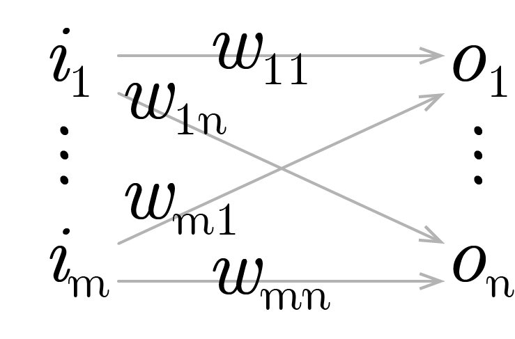

Abaixo deriva-se o algoritmo de backpropagation. Pretende-se uma abordagem modular, tão simples e compacta quanto possível, adotando-se, para tanto, a notação vetorial. Embora matematicamente equivalente às derivações apresentadas em (XXX), optou-se por uma abordagem direta com a intenção de tornar mais intuitivo o entendimento do algoritmo, e mais hermética sua formulação.
É conveniente ressaltar que a notação utilizada, embora não sem ressonância com a literatura (XXX), não é a mais comumente utilizada: em particular a forma como os pesos foram indexados. 
Assim, assumindo conceitualmente uma camada de uma rede neural conforme o diagrama abaixo:

{width=200px}

De onde definem-se os seguintes tensores:

$$
\begin{align}
I_{1 \times m} :=& [i_1 \dots i_m]
\\
W_{m \times n} :=&
\left[ \begin{matrix}
w_{11} & \dots & w_{1n} \\
\vdots & \ddots & \vdots \\
w_{m1} & \dots & w_{mn}
\end{matrix} \right]
\\
A_{1 \times n} :=& [a_1 \dots a_n] \ |\ 
a_y := w_{1y}i_1 + \dots + w_{ny}i_n
\\
O_{1 \times n} :=& [o_1 \dots o_n] \ |\ 
o_y := f(a_y) = f(w_{1y}i_1 + \dots + w_{ny}i_n)
\\
E_{1 \times n} :=& [e_1 \dots e_n] \ |\ 
e_y := \varepsilon (o_y, t_y) = 
\varepsilon (f(w_{1y}i_1 + \dots + w_{ny}i_n) , t_y) \\
q :=& [e_1 + \dots + e_n]
\end{align}
$$
Tem-se que o gradiente do tensor de erros em relação a um peso arbitrário pode ser escrito da forma abaixo, com aplicação direta da regra da cadeia, e observando a seguinte notação para uma função qualquer $ h(x) $:  ${\partial  \over \partial x}h(x) = h'(x)$:

$$
\begin{align}
{\partial q \over \partial w_{xy}} =&
\varepsilon' (o_y, t_y) f'(a_y)i_x
\quad \text{Eq.:(I)}
\end{align}
$$

A matriz de incrementos para cada um dos pesos, a cada iteração, pode ser definida como abaixo, com a adição de uma taxa de aprendizado $\alpha$ com sinal negativo. Assim é uma vez que o gradiente acima aponta para sentido de maior crescimento dos erros no espaço dos pesos; minimizar os erros implica em mover os pesos em sentido oposto.

$$
\begin{align}
\Delta W_{m \times n} :=&
\left[ \begin{matrix}
\Delta w_{11} & \dots & \Delta w_{1n} \\
\vdots & \ddots & \vdots \\
\Delta w_{m1} & \dots & \Delta w_{mn}
\end{matrix} \right]  \ |\ 
\Delta w_{xy} := - \alpha {\partial q \over \partial w_{xy}} = - \alpha \varepsilon' (o_y, t_y) f'(a_y)i_x
\end{align}
$$

Resta definir a forma dos erros nas entradas da rede, permitindo assim que um número arbitrário de camadas sejam conectadas e treinadas. Para tanto, convém introduzir uma camada anterior à rede em tela, com a seguinte forma e notação:

{width=400px}

E, de forma análoga:

$$
\begin{align}
Z_{1 \times m} :=& [z_1 \dots z_m] \ |\ 
z_x := u_{1x}p_1 + \dots + u_{kx}p_k
\\
I_{1 \times m} =& [i_1 \dots i_m] \ |\ 
i_x := g(z_x) = g(u_{1x}p_1 + \dots + u_{kx}p_k)
\end{align}
$$

$$
\begin{align}
{\partial q \over \partial u_{rx}} =&
[
\varepsilon' (o_1, t_1) f'(a_1) w_{x1} g'(z_x)p_r
+ \dots +
\varepsilon' (o_n, t_n) f'(a_n) w_{xn} g'(z_x)p_r
]
\\ =&
[
\varepsilon' (o_1, t_1) f'(a_1) w_{x1}
+ \dots +
\varepsilon' (o_n, t_n) f'(a_n) w_{xn}
] g'(z_x)p_r
\end{align}
$$

Comparando com $\text{I}$ é fácil observar que o somatório na primeira parte da última expressão corresponde a derivada do erro na primeira equação. Podemos definir, da seguinte forma, o tensor do erro propagado:

$$
\begin{align}
E_{1 \times m}^b :=& [e_1^b \dots e_m^b] \ |\ 
e_x^b := \varepsilon' (o_1, t_1)f'(a_1)w_{x1} 
+ \dots + 
\varepsilon' (o_n, t_n) f'(a_n)w_{xn}
\end{align}
$$

Definimos, dessa forma, todos os termos necessários à uma arquitetura modular: para camadas ocultas, para as quais não há a possibilidade de aferirmos diretamente o erro, o mesmo é propagado a partir das camadas posteriores.
Em forma vetorial, pode-se sintetizar o algoritmo como abaixo, observando a conveniência de introduzirmos o tensor $H_{1 \times n}$  para evitar redundância nos cálculos, e a notação $\odot$ denotando o produto de Hadamard (elemento a elemento) entre dois tensores:
$$
\begin{align}
O =& f(IW) \\
H_{1 \times n} :=& E \odot f'(A)\\
\Delta W =& -\alpha I^t H= - \alpha I^t (E \odot f'(A)) \\
E^b =& HW^t= (E \odot f'(A)) W^t
\end{align}
$$