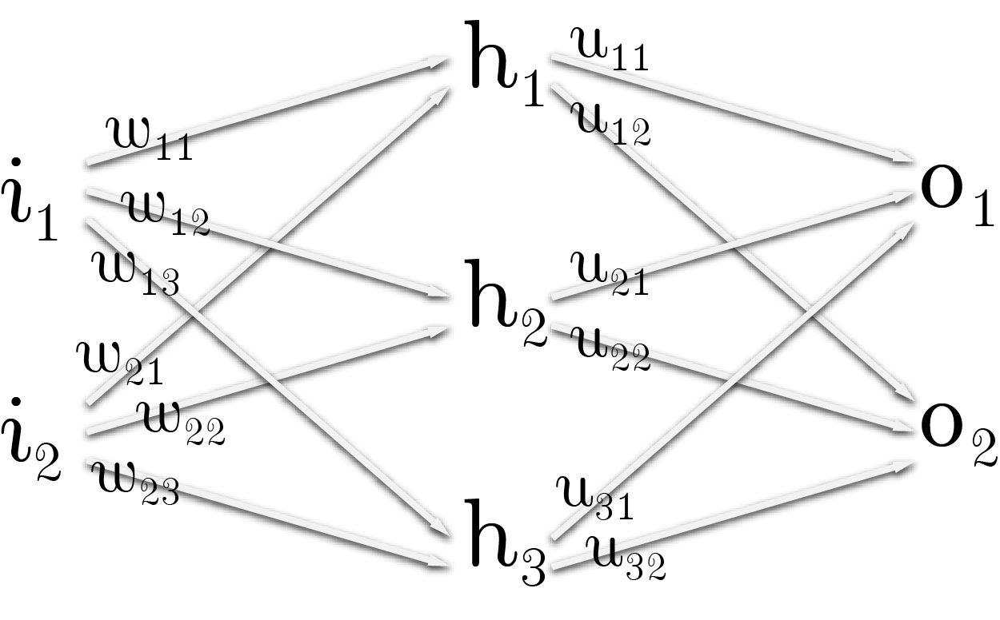

{width=500px}

$h_1=g(i_1 w_{11} + i_2 w_{21})$

$h_2=g(i_1 w_{12} + i_2 w_{22})$

$h_3=g(i_1 w_{13} + i_2 w_{23})$

***

$o_1=f(h_1 u_{11} + h_2 u_{21} + h_3 u_{31})$

$o_2=f(h_1 u_{12} + h_2 u_{22} + h_3 u_{32})$

***

$
E={1 \over 2}
\left(
  (f(h_1 u_{11} + h_2 u_{21} + h_3 u_{31})-t_1)^2
  +
  (f(h_1 u_{12} + h_2 u_{22} + h_3 u_{32})-t_2)^2
  \right)
$

***

$$
\begin{aligned}
{\partial E \over \partial u_{11}}
&= 
{1 \over 2} {\partial \over \partial u_{11}}
\left(
  (f(h_1 u_{11} + h_2 u_{21} + h_3 u_{31}) - t_1)^2
  +
  (f(h_1 u_{12} + h_2 u_{22} + h_3 u_{32}) - t_2)^2
\right) \\
&=
{1 \over 2}
\left(
  {\partial \over \partial u_{11}}
  (f(h_1 u_{11} + h_2 u_{21} + h_3 u_{31}) - t_1 )^2
  +
  {\partial \over \partial u_{11}}
  (f(h_1 u_{12} + h_2 u_{22} + h_3 u_{32}) - t_2)^2
\right) \\
&=
{1 \over 2} {\partial \over \partial u_{11}}
(f(h_1 u_{11} + h_2 u_{21} + h_3 u_{31}) - t_1 )^2 
\\
&= 
{2 \over 2}
(f(h_1 u_{11} + h_2 u_{21} + h_3 u_{31}) - t_1)
\left(
  {\partial f \over \partial u_{11}}
  (h_1 u_{11} + h_2 u_{21} + h_3 u_{31})
  \left(
    {\partial \over \partial u_{11}} h_1 u_{11} +
    {\partial \over \partial u_{11}} h_2 u_{21} +
    {\partial \over \partial u_{11}} h_3 u_{31}
  \right)
  -
  {\partial t_1 \over \partial u_{11}}
\right) 
\\
&= h_1 (f(h_1 u_{11} + h_2 u_{21} + h_3 u_{31}) -t_1)
f'(h_1 u_{11} + h_2 u_{21} + h_3 u_{31})
\end{aligned}
$$

***
***

$$
\begin{aligned}
{\partial E \over \partial w_{11}} =&
{1 \over 2} {\partial \over \partial w_{11}}
\left(
  (f(h_1 u_{11} + h_2 u_{21} + h_3 u_{31}) - t_1)^2
  +
  (f(h_1 u_{12} + h_2 u_{22} + h_3 u_{32}) - t_2)^2
\right)  
\\
=& {1 \over 2}
\left(
  {\partial \over \partial w_{11}}
  (f(h_1 u_{11} + h_2 u_{21} + h_3 u_{31}) - t_1)^2
  +
  {\partial \over \partial w_{11}}
  (f(h_1 u_{12} + h_2 u_{22} + h_3 u_{32}) - t_2)^2
\right)
\\
=& {1 \over 2}
\Bigg(
  2 (f(h_1 u_{11} + h_2 u_{21} + h_3 u_{31}) - t_1)
  {\partial \over \partial w_{11}}
  (f(h_1 u_{11} + h_2 u_{21} + h_3 u_{31}) - t_1)
\\
  +& \ \ \ \ \ \ 
  2 (f(h_1 u_{12} + h_2 u_{22} + h_3 u_{32}) - t_2)
  {\partial \over \partial w_{11}}
  (f(h_1 u_{12} + h_2 u_{22} + h_3 u_{32}) - t_2)
\Bigg)
\\
=& (f(h_1 u_{11} + h_2 u_{21} + h_3 u_{31}) - t_1)
\left(
  {\partial \over \partial w_{11}}  
  f(h_1 u_{11} + h_2 u_{21} + h_3 u_{31})
  -
  {\partial \over \partial w_{11}} t_1
\right)
\\
+& (f(h_1 u_{12} + h_2 u_{22} + h_3 u_{32}) - t_2)
\left(
  {\partial \over \partial w_{11}}
  f(h_1 u_{12} + h_2 u_{22} + h_3 u_{32})
  -
  {\partial \over \partial w_{11}} t_2
\right)
\\
=& (f(h_1 u_{11} + h_2 u_{21} + h_3 u_{31}) - t_1)
  f'(h_1 u_{11} + h_2 u_{21} + h_3 u_{31})
\left(
  {\partial h_1 u_{11} \over \partial w_{11}} +
  {\partial h_2 u_{21} \over \partial w_{11}} +
  {\partial h_3 u_{31} \over \partial w_{11}}
\right)
\\
+& (f(h_1 u_{12} + h_2 u_{22} + h_3 u_{32}) - t_2)
  f'(h_1 u_{12} + h_2 u_{22} + h_3 u_{32})
\left(
  {\partial h_1 u_{12} \over \partial w_{11}} +
  {\partial h_2 u_{22} \over \partial w_{11}} +
  {\partial h_3 u_{32} \over \partial w_{11}}
\right)
\\
=& (f(h_1 u_{11} + h_2 u_{21} + h_3 u_{31}) - t_1)
f'(h_1 u_{11} + h_2 u_{21} + h_3 u_{31})
\left(
  {\partial h_1 u_{11} \over \partial w_{11}}
\right)
\\
+& (f(h_1 u_{12} + h_2 u_{22} + h_3 u_{32}) - t_2)
f'(h_1 u_{12} + h_2 u_{22} + h_3 u_{32})
\left(
  {\partial h_1 u_{12} \over \partial w_{11}}
\right)
\\
=& (f(h_1 u_{11} + h_2 u_{21} + h_3 u_{31})-t_1)
f'(h_1 u_{11} + h_2 u_{21} + h_3 u_{31})
(u_{11}i_1 g' (i_1 w_{11} + i_2 w_{21}))
\\
+& (f(h_1 u_{12} + h_2 u_{22} + h_3 u_{32}) - t_2)
f'(h_1 u_{12} + h_2 u_{22} + h_3 u_{32})
(u_{12}i_1 g' (i_1 w_{11} + i_2 w_{21}))
\end{aligned}
$$

***
***

$$
\begin{aligned}
{\partial E \over \partial u_{11}} =&
h_1 (f(h_1 u_{11} + h_2 u_{21} + h_3 u_{31}) -t_1)
f'(h_1 u_{11} + h_2 u_{21} + h_3 u_{31})
\\
{\partial E \over \partial w_{11}} =& 
(f(h_1 u_{11} + h_2 u_{21} + h_3 u_{31}) - t_1 )
f'(h_1 u_{11} + h_2 u_{21} + h_3 u_{31})
\left(
  u_{11}i_1 g'
  (i_1 w_{11} + i_2 w_{21})
\right)
\\
+& (f(h_1 u_{12} + h_2 u_{22} + h_3 u_{32}) - t_2 )
f'(h_1 u_{12} + h_2 u_{22} + h_3 u_{32})
( u_{12}i_1 g' (i_1 w_{11} + i_2 w_{21}) )
\end{aligned}
$$

***
***

$
E^* = {1 \over 2}
\left(
  (h1-t^*_1)^2 + (h2-t^*_2)^2 + (h3-t^*_3)^2
\right)
$

***

$$
\begin{aligned}
{\partial E^* \over \partial w_{11}} =& {1 \over 2}
\left(
  {\partial \over \partial w_{11}} (h1-t^*_1)^2 +
  {\partial \over \partial w_{11}} (h2-t^*_2)^2 +
  {\partial \over \partial w_{11}} (h3-t^*_3)^2
\right)
\\
=& {2 \over 2} (h1-t^*_1) 
{\partial \over \partial w_{11}} (h1) -
{\partial \over \partial w_{11}} (t^*_1) = 
(h1-t^*_1) {\partial \over \partial w_{11}} (h1)
\\
=& i_1 (h1-t^*_1)  g' (i_1 w_{11} + i_2 w_{21})
\end{aligned}
$$

***

$$
\begin{aligned}
e^*_1 = h1-t^*_1 =& 
\end{aligned}
$$