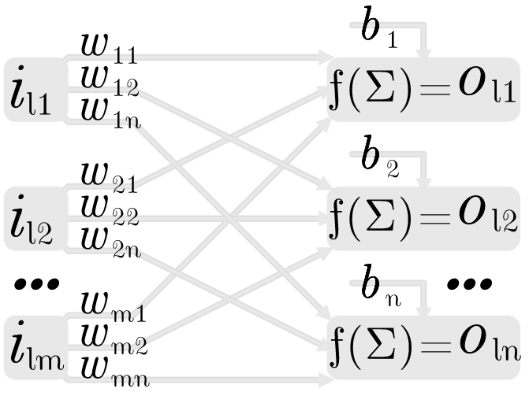

{width=300px}

$I_{s \times m} = 
\left[\begin{matrix}
i_{11} & i_{12} & \dots & i_{1m}   \\
i_{21} & i_{22} & \dots & i_{2m}   \\
\vdots & \vdots & \ddots & \vdots  \\
i_{s1} & i_{s2} & \dots & i_{sm}
\end{matrix}\right]
W_{m \times n} =
\left[\begin{matrix}
w_{11} & w_{12} & \dots & w_{1n}    \\
w_{21} & w_{22} & \dots & w_{2n}    \\
\vdots & \vdots & \ddots & \vdots   \\
w_{m1} & w_{m2} & \dots & w_{mn}
\end{matrix}\right]
T_{s \times n} =
\left[\begin{matrix}
t_{11} & t_{12} & \dots & t_{1n}    \\
t_{21} & t_{22} & \dots & t_{2n}    \\
\vdots & \vdots & \ddots & \vdots   \\
t_{s1} & t_{s2} & \dots & t_{sn} 
\end{matrix}\right]
U_{s \times 1} =
\left[\begin{matrix}
1 \\ 1 \\ \vdots \\ 1 
\end{matrix}\right]
B_{1 \times n} =
\left[\begin{matrix}
b_1 & b_2 & \dots & b_n 
\end{matrix}\right]$

$A_{s \times n} =
\left[\begin{matrix}
a_{11} & a_{12} & \dots & a_{1n} \\
a_{21} & a_{22} & \dots & a_{2n}  \\
\vdots & \vdots & \ddots & \vdots    \\
a_{s1} & a_{s2} & \dots & a_{sn} 
\end{matrix}\right] 
= 
IW+UB
= \\
\left[\begin{matrix}
i_{11}w_{11}+i_{12}w_{21}+\dots+i_{1m}w_{m1}+b_1 &
i_{11}w_{12}+i_{12}w_{22}+\dots+i_{1m}w_{m2}+b_2 &
\dots&
i_{11}w_{1n}+i_{12}w_{2n}+\dots+i_{1m}w_{mn}+b_n\\
i_{21}w_{11}+i_{22}w_{21}+\dots+i_{2m}w_{m1}+b_1 &
i_{21}w_{12}+i_{22}w_{22}+\dots+i_{2m}w_{m2}+b_2 &
\dots&
i_{21}w_{1n}+i_{22}w_{2n}+\dots+i_{2m}w_{mn}+b_n\\
\vdots & \vdots & \ddots & \vdots\\
i_{s1}w_{11}+i_{s2}w_{21}+\dots+i_{sm}w_{m1}+b_1 &
i_{s1}w_{12}+i_{s2}w_{22}+\dots+i_{sm}w_{m2}+b_2 &
\dots&
i_{s1}w_{1n}+i_{s2}w_{2n}+\dots+i_{sm}w_{mn}+b_n\\
\end{matrix}\right]$

$O_{s \times n} 
=
\left[\begin{matrix}
o_{11} & o_{12} & \dots & o_{1n}  \\
o_{21} & o_{22} & \dots & o_{2n}  \\
\vdots & \vdots & \ddots & \vdots \\
o_{s1} & o_{s2} & \dots & o_{sn} 
\end{matrix}\right] 
= 
f(A_{s \times n})
=
\left[\begin{matrix}
f(a_{11}) & f(a_{12}) & \dots & f(a_{1n}) \\
f(a_{21}) & f(a_{22}) & \dots & f(a_{2n}) \\
\vdots & \vdots & \ddots & \vdots         \\
f(a_{s1}) & f(a_{s2}) & \dots & f(a_{sn}) 
\end{matrix}\right]$

$E_{s \times n} =
\left[\begin{matrix}
e_{11} & e_{12} & \dots & e_{1n}  \\
e_{21} & e_{22} & \dots & e_{2n}  \\
\vdots & \vdots & \ddots & \vdots \\
e_{s1} & e_{s2} & \dots & e_{sn} 
\end{matrix}\right]
=
\left[\begin{matrix}
{1 \over 2}(t_{11} - o_{11})^2 & 
{1 \over 2}(t_{12} - o_{12})^2 & 
\dots & 
{1 \over 2}(t_{1n} - o_{1n})^2 \\
{1 \over 2}(t_{21} - o_{21})^2 & 
{1 \over 2}(t_{22} - o_{22})^2 & 
\dots & 
{1 \over 2}(t_{2n} - o_{2n})^2 \\
\vdots & \vdots & \ddots & \vdots    \\
{1 \over 2}(t_{s1} - o_{s1})^2 & 
{1 \over 2}(t_{s2} - o_{s2})^2 & 
\dots & 
{1 \over 2}(t_{sn} - o_{sn})^2 
\end{matrix}\right]$

****
$\Delta W_{m \times n} = \alpha {\partial (I^\top  E) \over \partial W }$
